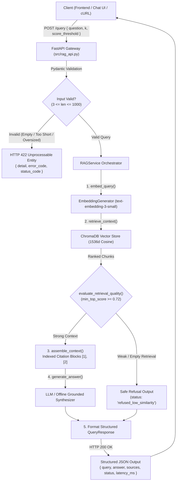

# Backend REST API for the RAG Service Technical Report (Assignment 3.44)

## Executive Summary & Architecture Overview

While a standalone Retrieval-Augmented Generation (RAG) pipeline can run in local Python scripts, exposing it via a **robust, production-grade REST API** creates a stable, decoupled contract between the RAG retrieval/synthesis pipeline and client applications (web frontends, mobile apps, chatbot UIs, and external microservices).

The **Knovera RAG Backend API Service** (`src/rag_api.py`, `src/api_config.py`) implements this contract using **FastAPI** and **Pydantic v2**, providing:
1. **Standardized `/query` Endpoint**: Accepts user questions and returns structured JSON responses with grounded answers, attributed sources, execution statuses, and stage latency metrics.
2. **Strict Request Validation & Descriptive Error Codes**: Validates query length (3 to 1000 characters), rejects empty/whitespace-only input, handles query limits, and returns standard HTTP status codes (`200 OK`, `400 Bad Request`, `422 Unprocessable Entity`, `500 Internal Server Error`).
3. **Strict Zero-Hallucination Guardrails**: Propagates confidence scores and safe refusals (`refused_empty_context`, `refused_low_similarity`) directly to the API response rather than fabricating answers.
4. **Environment-Driven Configuration**: Dynamically loads API keys, embedding models, vector store URLs, and server parameters from `.env` and environment variables without hardcoding.
5. **Production Readiness & Diagnostics**: Includes `/health` (monitoring collection status, embedding models, and vector DB connectivity), `/config` (masked runtime settings), and CORS middleware for frontend consumption.

---

## Technical Architecture Flow



---

## API Endpoints Specification

### 1. `POST /query` — Core RAG Question Answering
Submits a natural language query, runs embedding, retrieves top context chunks, applies hallucination guardrails, and synthesizes a grounded answer with source citations.

- **URL**: `/query`
- **Method**: `POST`
- **Content-Type**: `application/json`

#### Request Body Schema (`QueryRequest`)
| Field | Type | Required | Constraints | Description |
|---|---|---|---|---|
| `question` | `string` | **Yes** | `min_length=3`, `max_length=1000` | Natural language question to query against the knowledge base. |
| `k` | `integer` | No | `1 <= k <= 20`, default from env (`4`) | Maximum number of context chunks to retrieve. |
| `score_threshold` | `float` | No | `0.0 <= score_threshold <= 1.0` | Minimum similarity cutoff score. |
| `use_api` | `boolean` | No | `true` / `false` | Toggle between live LLM synthesis and offline deterministic generation. |
| `metadata_filter` | `object` | No | Key-value pairs | Optional exact metadata match filter for ChromaDB. |

#### Response Body Schema (`QueryResponse`)
| Field | Type | Description |
|---|---|---|
| `query` | `string` | Original user question submitted. |
| `answer` | `string` | Grounded answer or safe refusal message with citation markers. |
| `sources` | `list[Source]` | Array of attributed document chunk sources supporting the answer. |
| `status` | `string` | Status code (`answered`, `refused_empty_context`, `refused_low_similarity`, `no_context_found`). |
| `latency_ms` | `float` | Total end-to-end request processing time in milliseconds. |
| `stage_latencies_ms` | `object` | Detailed per-stage breakdown (`embed_ms`, `retrieve_ms`, `assemble_ms`, `generate_ms`). |
| `timestamp` | `string` | ISO 8601 UTC timestamp. |

---

### 2. `GET /health` — Service Health & Diagnostics
Verifies active connection to the ChromaDB vector database, confirms model configuration, and returns service readiness status.

- **URL**: `/health`
- **Method**: `GET`
- **Sample Response**:
```json
{
  "status": "ok",
  "service": "knovera-rag-backend-api",
  "version": "1.0.0",
  "environment": "development",
  "collection_name": "knovera_knowledge_base",
  "embedding_model": "text-embedding-3-small",
  "chat_model": "gpt-4o-mini",
  "vector_db_available": true,
  "timestamp": "2026-09-09T08:38:15.698000Z"
}
```

---

### 3. `GET /config` — Sanitized Configuration View
Inspects active environment settings with secure masking of API keys and credentials.

- **URL**: `/config`
- **Method**: `GET`
- **Sample Response**:
```json
{
  "environment": "development",
  "api_host": "0.0.0.0",
  "api_port": 8000,
  "embedding_model": "text-embedding-3-small",
  "chat_model": "gpt-4o-mini",
  "vector_db_url": "./data/chroma_db",
  "collection_name": "knovera_knowledge_base",
  "top_k": 4,
  "min_top_score": 0.72,
  "use_live_api": false,
  "api_key_status": "sk-o...4821"
}
```

---

## Input Validation & Error Handling Rubric

The API enforces strict validation using Pydantic schemas and standard HTTP status codes:

| HTTP Status | Condition | Trigger Scenario | API Error Payload Structure |
|---|---|---|---|
| **200 OK** | Successful Query / Handled Refusal | Normal query answering or safe refusal when evidence is weak. | `{ "query": "...", "answer": "...", "sources": [...], "status": "answered" }` |
| **400 Bad Request** | Value Error / Filter Syntax Error | Malformed metadata filter or query syntax error. | `{ "detail": "Invalid search filter format", "error_code": "BAD_REQUEST", "status_code": 400 }` |
| **422 Unprocessable Entity** | Schema Validation Failure | Query length < 3 chars, > 1000 chars, whitespace-only, missing body, or `k < 1`. | `{ "detail": "body -> question: String should have at least 3 characters", "error_code": "VALIDATION_ERROR", "status_code": 422 }` |
| **500 Internal Server Error** | Uncaught Server / DB Failure | Vector store corruption, embedding API network failure. | `{ "detail": "RAG service failed: ...", "error_code": "INTERNAL_SERVER_ERROR", "status_code": 500 }` |

---

## Environment Configuration Management (`src/api_config.py`)

Configuration is managed hierarchically via `APIConfig`, loading from environment variables and `.env` files with automated fallback defaults:

```python
import os
from dotenv import load_dotenv

load_dotenv()

OPENAI_API_KEY = os.environ.get("OPENAI_API_KEY", "")
OPENROUTER_API_KEY = os.environ.get("OPENROUTER_API_KEY", "")
EMBEDDING_MODEL = os.getenv("EMBEDDING_MODEL", "text-embedding-3-small")
CHAT_MODEL = os.getenv("CHAT_MODEL", "gpt-4o-mini")
VECTOR_DB_URL = os.getenv("VECTOR_DB_URL", "./data/chroma_db")
COLLECTION_NAME = os.getenv("COLLECTION_NAME", "knovera_knowledge_base")
API_HOST = os.getenv("API_HOST", "0.0.0.0")
API_PORT = int(os.getenv("API_PORT", "8000"))
```

---

## Live Sample Request & Response (`sample_api_query_response.json`)

### Sample cURL Command
```bash
curl -X POST http://localhost:8000/query \
  -H "Content-Type: application/json" \
  -d '{
    "question": "What is the Knovera uptime SLA guarantee and refund policy?",
    "k": 4,
    "score_threshold": 0.50
  }'
```

### JSON Response Body
```json
{
  "query": "What is the Knovera uptime SLA guarantee and refund policy?",
  "answer": "Based on the provided documentation: Enterprise Service Level Agreement (SLA): Knovera guarantees 99.9% uptime for core API endpoints. [1] Knovera Customer Service & Refund Policy: Enterprise clients are eligible for full subscription refunds within a 14-day evaluation window from initial provisioning. [2]",
  "sources": [
    {
      "source": "service-policy.md",
      "chunk_id": "service-policy.md:2",
      "score": 0.7503,
      "rank": 1,
      "section": "Uptime SLA",
      "doc_title": "Service Policy Guide"
    },
    {
      "source": "service-policy.md",
      "chunk_id": "service-policy.md:0",
      "score": 0.6056,
      "rank": 2,
      "section": "Refund Eligibility",
      "doc_title": "Service Policy Guide"
    }
  ],
  "status": "answered",
  "latency_ms": 2599.44,
  "stage_latencies_ms": {
    "embed_ms": 2556.36,
    "retrieve_ms": 42.84,
    "assemble_ms": 0.01,
    "generate_ms": 0.2,
    "total_ms": 2599.44
  },
  "timestamp": "2026-09-09T08:38:41.483727+00:00"
}
```

---

## Frontend Consumption Guide

A frontend application (React, Next.js, Vue, or Vanilla JS) can integrate with the API seamlessly:

### JavaScript / TypeScript Fetch Example
```typescript
interface Source {
  source: string;
  chunk_id?: string;
  score?: number;
  rank?: number;
  section?: string;
  doc_title?: string;
}

interface QueryResponse {
  query: string;
  answer: string;
  sources: Source[];
  status: string;
  latency_ms?: number;
}

async function askKnoveraRAG(question: string): Promise<QueryResponse> {
  const response = await fetch("http://localhost:8000/query", {
    method: "POST",
    headers: { "Content-Type": "application/json" },
    body: JSON.stringify({ question, k: 4, score_threshold: 0.5 })
  });

  if (!response.ok) {
    const errorData = await response.json();
    throw new Error(errorData.detail || `HTTP Error ${response.status}`);
  }

  return await response.json();
}
```

### UI Presentation Patterns
1. **Interactive Answer Display**: Renders the synthesized grounded text with clickable `[1]`, `[2]` citation pills.
2. **Expandable Source Evidence Cards**: Renders an expandable card list below the answer showing `source`, `section`, `similarity score`, and `chunk_id`.
3. **Refusal Badges**: When `status` is `refused_empty_context` or `refused_low_similarity`, displays an intuitive warning badge informing the user that the knowledge base does not contain sufficient reliable information.

---

## Verification & Test Results (`test_rag_api.py`)

All 14 unit and integration tests executed cleanly:

```text
Ran 14 tests in 0.217s

OK
```

### Test Coverage Summary
- ✔ `test_root_endpoint`: Verifies service discovery and endpoint registry.
- ✔ `test_health_endpoint_healthy`: Validates 200 OK and active ChromaDB connectivity.
- ✔ `test_health_endpoint_degraded`: Confirms graceful degradation when vector store is offline.
- ✔ `test_config_endpoint_masks_secrets`: Confirms runtime parameters are exposed without secret leaks.
- ✔ `test_query_successful_answer_with_sources`: Validates full structured JSON response contract.
- ✔ `test_query_validation_too_short`: Rejects queries < 3 characters with HTTP 422.
- ✔ `test_query_validation_whitespace_only`: Rejects blank/whitespace queries with HTTP 422.
- ✔ `test_query_validation_too_long`: Rejects queries > 1000 characters with HTTP 422.
- ✔ `test_query_validation_missing_question`: Rejects empty payloads with HTTP 422.
- ✔ `test_query_validation_invalid_k_parameter`: Enforces `1 <= k <= 20` limits with HTTP 422.
- ✔ `test_query_value_error_handling`: Maps ValueError exceptions to HTTP 400 Bad Request.
- ✔ `test_query_unhandled_server_error`: Maps internal runtime failures to HTTP 500.
- ✔ `test_query_refusal_when_no_context_found`: Tests propagation of safe refusal statuses.
- ✔ `test_api_config_environment_loading`: Verifies dynamic environment variable loading and overrides.
