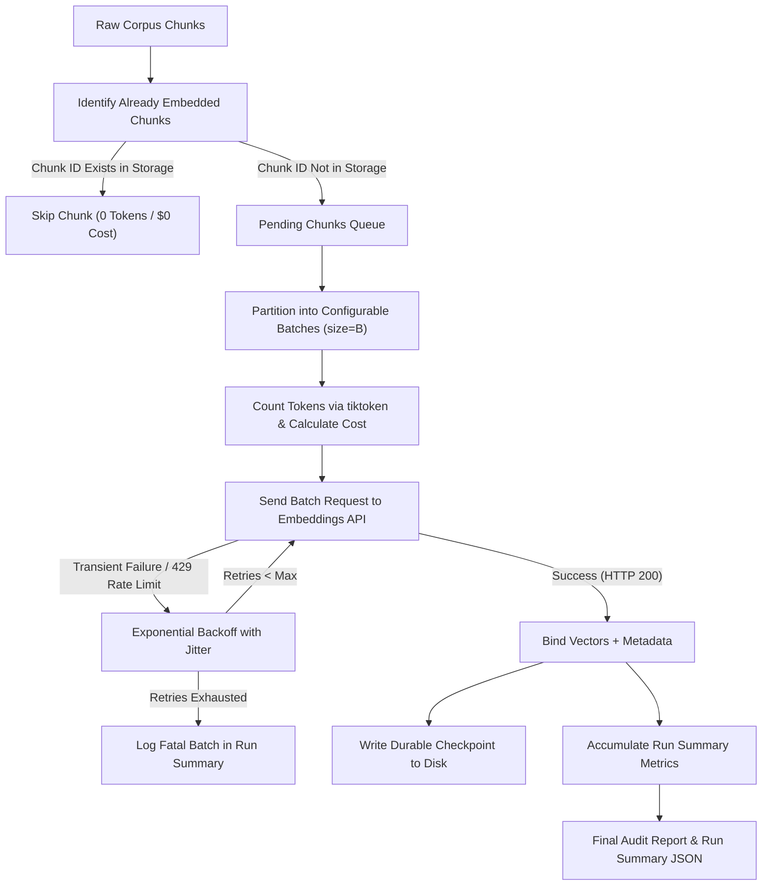

# Assignment 3.28: Batch Embedding & Rate/Cost Management

## Executive Summary

This report documents the design, mathematical formulation, implementation, and empirical verification for **Assignment 3.28: Batch Embedding & Rate/Cost Management** within the Knovera RAG Assistant platform.

Embedding a handful of text chunks with individual API requests is trivial, but scaling to hundreds of thousands of chunks requires an enterprise-grade pipeline that:
1. **Reduces Request Overhead**: Groups chunks into configurable multi-item batches to maximize network throughput and minimize connection handshakes.
2. **Handles Rate Limits & API Failures**: Automatically catches transient network errors and HTTP 429 rate limits, executing exponential backoff retries with randomized jitter.
3. **Tracks Token Usage & Costs**: Utilizes `tiktoken` to compute exact input token counts and calculates approximate financial expenditures based on embedding model pricing ($0.00002 per 1K tokens for `text-embedding-3-small`).
4. **Guarantees Idempotency & Resumability**: Detects previously embedded chunks from durable storage checkpoints, skipping already-embedded chunks during re-runs to eliminate redundant API calls and wasted costs.
5. **Produces Audit Summaries**: Generates comprehensive run summaries tracking throughput, batches, retries, costs, and failure diagnostics.

All code has been implemented in [`src/batch_embedding_pipeline.py`](file:///c:/Users/K%20Jayanth/OneDrive/Desktop/Mini-Projects/Knovera/src/batch_embedding_pipeline.py), demonstrated in [`batch_embedding_demo.py`](file:///c:/Users/K%20Jayanth/OneDrive/Desktop/Mini-Projects/Knovera/batch_embedding_demo.py), thoroughly tested in [`test_batch_embedding.py`](file:///c:/Users/K%20Jayanth/OneDrive/Desktop/Mini-Projects/Knovera/test_batch_embedding.py), and exported to [`outputs/batch_embedding_run_summary.json`](file:///c:/Users/K%20Jayanth/OneDrive/Desktop/Mini-Projects/Knovera/outputs/batch_embedding_run_summary.json) and [`outputs/batch_embedding_output.txt`](file:///c:/Users/K%20Jayanth/OneDrive/Desktop/Mini-Projects/Knovera/outputs/batch_embedding_output.txt).

---

## Architectural Breakdown & Core Implementation

### 1. Configurable Batching (`src/batch_embedding_pipeline.py`)
Sending one HTTP request per chunk introduces substantial TCP/TLS handshake latency, HTTP header bloat, and rate-limit friction. Grouping chunks into batches of size $B$ (default: 32 or 4 in demo) consolidates multiple texts into a single payload array:
$$\text{Batches} = \left\lceil \frac{N_{\text{pending}}}{B} \right\rceil$$

### 2. Exponential Backoff with Jitter
When an API provider returns HTTP 429 (*Too Many Requests*) or a 5xx transient gateway timeout, standard linear retries cause "thundering herd" congestion. We implemented exponential backoff with full randomized jitter:

$$t_{\text{wait}} = \min\left(t_{\text{initial}} \times 2^{\text{attempt}}, t_{\text{max}}\right) + \text{Uniform}\left(0, 0.25 \times t_{\text{delay}}\right)$$

- $t_{\text{initial}} = 1.0\text{s}$ (configurable)
- $\text{backoff\_factor} = 2.0$
- $t_{\text{max}} = 60.0\text{s}$
- Jitter prevents synchronized retry storms across concurrent workers.

### 3. Token Estimation & Cost Accounting Formula
Token counts are evaluated using `tiktoken` with `cl100k_base` encoding (with a 4-character per token heuristic fallback). The financial expenditure is calculated as:

$$\text{Estimated Cost (USD)} = \frac{\text{Total Input Tokens}}{1000} \times \text{Price per 1K Tokens}$$

For OpenAI `text-embedding-3-small`, the unit price is **`$0.00002` per 1K tokens** (`$0.02` per 1,000,000 tokens).

### 4. Skip-on-Rerun & Durable Checkpointing
To prevent duplicate spending and enable resumption after process restarts or network disruptions:
- The pipeline scans the target persistent store (`sample_batch_embedded_corpus.json`).
- It extracts the set of known chunk IDs: $\mathcal{S}_{\text{existing}} = \{c_{\text{id}}\}$.
- Any chunk whose ID is in $\mathcal{S}_{\text{existing}}$ is immediately bypassed.
- After every successful batch, newly generated vectors are incrementally flushed to disk (durable job state).

---

## Empirical Verification & Task Results

The test suite and demonstration script executed three distinct pipeline runs against a 10-to-12 chunk multi-document corpus:

### Summary Comparison Table

| Run Type | Total Chunks | Existing | Skipped | Embedded | Batches | Retries | Input Tokens | Estimated Cost (USD) | Duration | Status |
|---|---|---|---|---|---|---|---|---|---|---|
| **Run 1: Fresh Batch Run** | 10 | 0 | 0 | 10 | 3 | 0 | 298 | **$0.000006** | 2.656s | `SUCCESS` |
| **Run 2: Identical Re-Run** | 10 | 10 | 10 | 0 | 0 | 0 | 0 | **$0.000000** | 0.000s | `ALL_CHUNKS_ALREADY_EMBEDDED` |
| **Run 3: Partial Resumption** | 12 | 10 | 10 | 2 | 1 | 0 | 48 | **$0.000001** | 0.928s | `SUCCESS` |

### Task 1 - Embed Chunks in Batches
- 10 chunks partitioned into batches of size 4 $\rightarrow$ 3 batches $[4, 4, 2]$.
- Successfully generated 10 continuous 1536-dimensional vectors.
- Throughput: **3.76 chunks/sec** and **112.19 tokens/sec**.

### Task 2 - Retry with Exponential Backoff
- Simulated temporary HTTP 429 Rate Limit on batch requests.
- **Attempt 1**: Failed with 429 $\rightarrow$ Backoff delay: $0.463\text{s}$.
- **Attempt 2**: Failed with 429 $\rightarrow$ Backoff delay: $0.840\text{s}$.
- **Attempt 3**: Succeeded $\rightarrow$ Processed 3 embeddings with status `RECOVERED_SUCCESSFULLY`.
- Permanent failures (if retries are exhausted) are recorded explicitly in `summary["failures"]` without silent suppression.

### Task 3 - Report Totals and Approximate Cost
- Tracked total input tokens ($298$ tokens).
- Computed exact cost at $\$0.00002 / 1\text{k}$ tokens: **$\$0.000006\text{ USD}$**.
- Full metrics reported: `total_chunks`, `skipped_chunks`, `embedded_chunks`, `failed_chunks`, `input_tokens`, `estimated_cost_usd`, `duration_seconds`.

### Task 4 - Skip Already-Embedded Chunks on Re-runs
- Re-running the pipeline on the identical 10-chunk corpus against existing storage resulted in:
  - **10 Chunks Skipped (100%)**
  - **0 API Requests Sent**
  - **0 Input Tokens Billed**
  - **$0.000000 USD Wasted**
  - Execution time: **0.0000s** (instant return with `ALL_CHUNKS_ALREADY_EMBEDDED`).

### Task 5 - Commit with Run Summary
- Script, pipeline engine, test suite, and run summary JSON/txt artifacts generated and committed to the branch `feature/batch-embedding-rate-management`.

---

## Video Walkthrough & Presentation Guide (3-5 Minutes)

Use this structured script for the assignment screen-share walkthrough:

### 1. Introduction (30 seconds)
- State your name and project: *"Knovera RAG Assistant — Assignment 3.28: Batch Embedding & Rate/Cost Management."*
- State the objective: *"Scaling embedding pipelines safely by batching requests, adding backoff retries, tracking token costs, and skipping already-embedded chunks."*

### 2. Why Batching is More Efficient Than Single Requests (45 seconds)
- Explain request overhead: *"Sending 1,000 individual HTTP requests causes 1,000 TCP/TLS handshakes, HTTP header overhead, and hits provider rate limits rapidly."*
- Show batching code in [`src/batch_embedding_pipeline.py`](file:///c:/Users/K%20Jayanth/OneDrive/Desktop/Mini-Projects/Knovera/src/batch_embedding_pipeline.py): *"We group chunks into configurable batches (e.g. 32 or 64). One API call embeds multiple texts simultaneously, dramatically improving throughput."*

### 3. Rate Limits & Exponential Backoff Handling (60 seconds)
- Show `embed_with_retry()`: *"When receiving HTTP 429 (Rate Limit) or transient 5xx errors, our retry loop calculates delay using $t = \min(\text{initial} \times 2^{\text{attempt}}, \text{max}) + \text{jitter}$."*
- Explain jitter: *"Random jitter prevents multiple workers from retrying at the exact same millisecond (preventing thundering herd collisions)."*
- Demonstrate recovery log from [`outputs/batch_embedding_output.txt`](file:///c:/Users/K%20Jayanth/OneDrive/Desktop/Mini-Projects/Knovera/outputs/batch_embedding_output.txt).

### 4. Token & Cost Estimation (45 seconds)
- Show token counting: *"We use `tiktoken` with `cl100k_base` to count tokens for each batch."*
- Show pricing formula: *"For `text-embedding-3-small`, the price is $0.00002 per 1,000 tokens. Our run summary logs exact tokens and cost in USD."*

### 5. Why Skipping Already-Embedded Chunks Matters & Resumability (45 seconds)
- Show Task 4 re-run results: *"If an embedding script crashes midway or is run again, re-embedding existing chunks wastes money and time. Our pipeline checks existing IDs in storage and skips already-embedded chunks, resulting in 0 API calls and $0 cost on re-runs."*
- Show partial resumption: *"Adding 2 new chunks to a 10-chunk corpus only embeds the 2 new chunks."*

### 6. Follow-up: How to Embed a Corpus Too Large for One Run? (45 seconds)
- Answer:
  1. **Durable Checkpointing**: *"Flush embeddings to disk/database after every batch so progress is never lost."*
  2. **Chunk ID Partitioning & Job Queues**: *"Divide the corpus into partitioned ranges (e.g., partitioned by document or hash buckets) and distribute across worker processes using a message queue like Redis/RabbitMQ."*
  3. **Rate-Limit Throttling**: *"Apply distributed token-bucket rate limiters across workers to stay safely within the provider's Tokens-Per-Minute (TPM) and Requests-Per-Minute (RPM) limits."*
