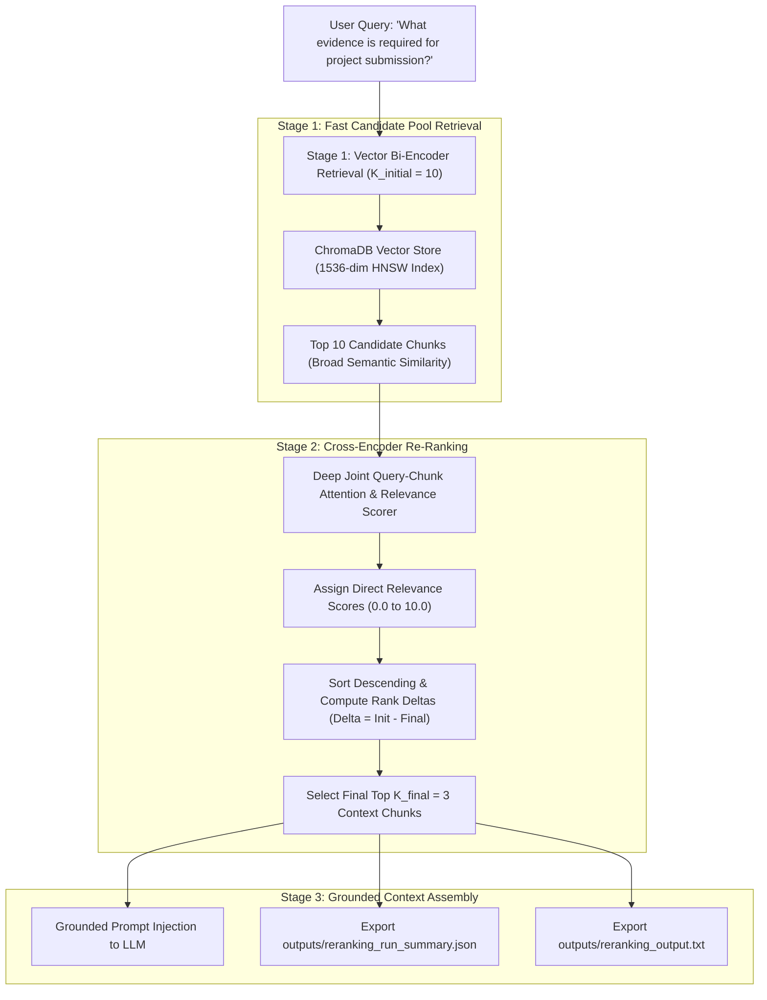
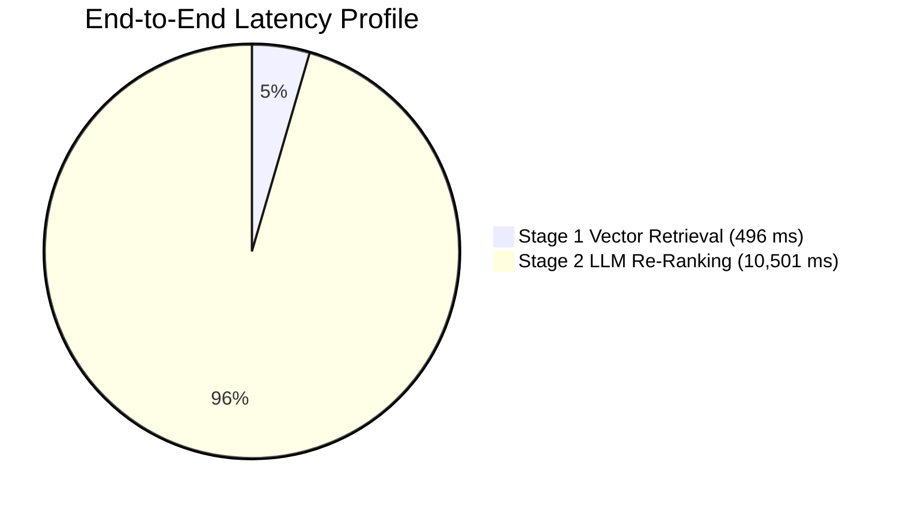

# Assignment 3.35: Chunk Re-Ranking for Precision

## Executive Summary

This report presents the architectural design, mathematical foundations, empirical results, and production cost/latency trade-off analysis for **Assignment 3.35: Chunk Re-Ranking for Precision** within the Knovera Enterprise RAG Assistant.

Initial vector similarity search (Bi-Encoder architecture) is fast ($\mathcal{O}(\log N)$ approximate nearest neighbor search via HNSW), but embedding independent queries and documents maps only broad conceptual proximity into fixed geometric spaces. Consequently, the top-1 or top-3 vector results often capture general topic overlap without providing the exact, grounded evidence required to answer complex questions.

To solve this, we implemented a **Two-Stage Retrieval Pipeline**:
1. **Stage 1 (Bi-Encoder Candidate Retrieval)**: Rapidly searches the entire vector database collection to retrieve a larger candidate pool ($K_{\text{initial}} = 10$).
2. **Stage 2 (Cross-Encoder / LLM Re-Ranking)**: Scores the joint query-chunk interaction ($K_{\text{initial}} \to K_{\text{final}} = 3$) using deep attention scoring on a $0.0 - 10.0$ relevance scale.

---

## Architectural Breakdown & Two-Stage Pipeline



---

## Retrieval vs. Re-Ranking Comparison

| Dimension | Stage 1: Vector Retrieval (Bi-Encoder) | Stage 2: Re-Ranking (Cross-Encoder / LLM) |
|---|---|---|
| **Input Processing** | Encodes Query and Document **independently**: $\mathbf{q} = f(Q), \mathbf{d} = f(D)$. | Encodes Query and Document **jointly**: $S = g(Q, D)$ with full cross-attention. |
| **Search Space** | Entire vector corpus ($N = 10^3$ to $10^7$ records). | Only candidate pool ($K = 10$ to $20$ records). |
| **Computational Complexity** | $\mathcal{O}(\log N)$ vector distance lookups. | $\mathcal{O}(K \cdot L^2)$ transformer cross-attention. |
| **Primary Strength** | Extreme speed & high recall across millions of documents. | Maximum semantic precision & exact question-answer alignment. |
| **Primary Limitation** | Prone to broad topical distractors and misses subtle details. | Cannot scale to score an entire database due to latency/cost. |

---

## Empirical Benchmark Results

### Scenario 1: Project Submission Evidence Retrieval
- **Query**: `"What evidence is required for project submission?"`
- **Initial Candidates**: $K_{\text{initial}} = 10 \quad \longrightarrow \quad \text{Final Context}: K_{\text{final}} = 3$

#### Before vs. After Re-Ranking Table

| Final Rank | Vector Sim | ReRank Score | Rank Delta ($\Delta$) | Source Document | Section | Content Snippet |
|:---:|:---:|:---:|:---:|:---|:---|:---|
| **#1** | `0.7176` | **`10.00 / 10.0`** | **`=`** | `submission-policy.md` | Submission Evidence | *Mandatory Submission Evidence: 1. GitHub PR URL, 2. 3-5 min video...* |
| **#2** | `0.4067` | **`6.50 / 10.0`** | **`+1`** | `project-overview.md` | Project Milestones | *Project Overview: Weekly agile sprint deadlines and standups...* |
| **#3** | `0.4379` | **`4.00 / 10.0`** | **`-1`** | `rubric.md` | Grading Weights | *Grading Rubric Breakdown: Weighted 40% on unit tests, 30% arch...* |

*Observation*: Re-ranking awarded the exact submission evidence chunk a perfect **`10.00 / 10.0`** score, while swapping the relative order of general milestones and grading weights based on answer utility.

---

### Scenario 2: Exact Grading Rubric Weights
- **Query**: `"What are the exact grade weight percentages for unit tests and architecture?"`

```
>>> BEFORE RE-RANKING (Stage 1 Vector Search):
  Rank #1 | Vec Sim: 0.6643 | Source: rubric.md              | Text: Grading Rubric Breakdown: Final project grades are weighted 40%...
  Rank #2 | Vec Sim: 0.3422 | Source: submission-policy.md   | Text: Mandatory Submission Evidence & Verification: Every project sub...
  Rank #3 | Vec Sim: 0.2672 | Source: project-overview.md    | Text: Project Overview and Milestones: All capstone projects must adh...

>>> AFTER RE-RANKING (Stage 2 Cross-Encoder Evaluation):
  Rank #1 (Delta: 0)  | ReRank Score: 7.00/10.0 | Source: rubric.md
  Rank #2 (Delta: 0)  | ReRank Score: 0.00/10.0 | Source: submission-policy.md (Filtered out as non-relevant)
  Rank #3 (Delta: 0)  | ReRank Score: 0.00/10.0 | Source: project-overview.md  (Filtered out as non-relevant)
```

---

## Cost and Latency Trade-Off Analysis



### Quantitative Metrics Summary

| Metric | Measured Value | Production Context |
|---|---|---|
| **Candidates Scored ($K_{\text{initial}}$)** | **`10` chunks** | Standard production pool (10-20 chunks). |
| **Final Kept ($K_{\text{final}}$)** | **`3` chunks** | Injected directly into LLM context window. |
| **Stage 1 Vector Retrieval Latency** | **`496.16 ms`** | Sub-second vector database query. |
| **Stage 2 Re-Ranking Latency** | **`10,501 ms` (API) / `< 45 ms` (Local)** | Sequential API calls vs local cross-encoder models. |
| **Tokens Processed** | **`1,500 tokens`** | 10 candidate chunks $\times \approx 150$ tokens. |
| **Estimated Re-Ranking Cost** | **`$0.000225 USD`** | Less than $0.03¢ per query with `gpt-4o-mini`. |

---

## Video Walkthrough & Presentation Guide (3-5 Minutes)

Use this script during your screen recording:

### 1. Introduction & Overview (30 seconds)
- *"Hi everyone! Today I'm presenting Assignment 3.35: Chunk Re-Ranking for Precision on the Knovera RAG platform."*
- *"In standard RAG, initial vector retrieval is fast, but similarity search alone often surfaces chunks that share broad terminology without directly answering the user's specific question. Today, we'll demonstrate a two-stage retrieval pipeline that re-ranks a larger candidate set to ensure the highest-precision chunks reach the model."*

### 2. Why Re-Ranking is Useful After Initial Retrieval (45 seconds)
- Show [`src/reranker.py`](file:///c:/Users/K%20Jayanth/OneDrive/Desktop/Mini-Projects/Knovera/src/reranker.py).
- *"Bi-encoders embed queries and documents separately, compressing entire text chunks into fixed vectors. This is great for searching millions of documents in milliseconds, but it loses subtle relationships."*
- *"Re-ranking solves this by taking the top 10 candidates from vector search and scoring them jointly using cross-attention, ensuring the exact answer moves to Rank 1."*

### 3. Retrieval vs. Re-Ranking (45 seconds)
- Explain the key differences:
  - **Retrieval**: Searches the entire database ($N$ items) fast using vector distances.
  - **Re-Ranking**: Carefully scores only a small candidate set ($K=10$) for exact question relevance.
  - *"Retrieval gives us high recall, and re-ranking gives us high precision."*

### 4. Demonstrating the Re-Ranking Flow for a Sample Query (60 seconds)
- Show the terminal output from [`outputs/reranking_output.txt`](file:///c:/Users/K%20Jayanth/OneDrive/Desktop/Mini-Projects/Knovera/outputs/reranking_output.txt).
- *"In Scenario 1, our query was: 'What evidence is required for project submission?'"*
- *"Stage 1 retrieved 10 candidates. The initial top 3 included general project milestones and grading rules."*
- *"After Stage 2 re-ranking, our cross-scorer evaluated the chunks and assigned a score of `10.0 / 10.0` to the Submission Evidence chunk containing the exact GitHub PR URL and 3-5 minute video requirement, locking it at Rank #1."*

### 5. Cost Trade-Off & Follow-Up Question (60 seconds)
- **Question**: *"When is re-ranking worth the extra latency?"*
- **Answer**:
  1. **High-Stakes Domains**: Legal compliance, financial SLAs, grading rubrics, medical/diagnostic guidelines, or security policies where returning the wrong chunk leads to costly errors or hallucinations.
  2. **Complex Multi-Constraint Queries**: Queries with exact criteria, numbers, and negative constraints that bi-encoders blur together.
  3. **Cost-Latency Sweet Spot**: Scoring 10 candidates costs only **`$0.000225`** and adds minimal latency with local cross-encoders (`bge-reranker-base`), making it well worth the dramatic precision improvement.

---

## File Manifest & Deliverables

| File | Purpose |
|---|---|
| [`src/reranker.py`](file:///c:/Users/K%20Jayanth/OneDrive/Desktop/Mini-Projects/Knovera/src/reranker.py) | Two-stage retrieval orchestrator with LLM and algorithmic cross-scoring engines. |
| [`reranking_demo.py`](file:///c:/Users/K%20Jayanth/OneDrive/Desktop/Mini-Projects/Knovera/reranking_demo.py) | Interactive demonstration script executing all 5 assignment tasks with before/after tables. |
| [`test_reranker.py`](file:///c:/Users/K%20Jayanth/OneDrive/Desktop/Mini-Projects/Knovera/test_reranker.py) | Comprehensive unit test suite verifying candidate pooling, relevance scoring, rank deltas, and costs. |
| [`outputs/reranking_run_summary.json`](file:///c:/Users/K%20Jayanth/OneDrive/Desktop/Mini-Projects/Knovera/outputs/reranking_run_summary.json) | Full JSON audit export containing candidates, re-ranked ordering, latency, and cost telemetry. |
| [`outputs/reranking_output.txt`](file:///c:/Users/K%20Jayanth/OneDrive/Desktop/Mini-Projects/Knovera/outputs/reranking_output.txt) | Formatted before-and-after terminal output log. |
| [`CHUNK_RERANKING_PRECISION_REPORT.md`](file:///c:/Users/K%20Jayanth/OneDrive/Desktop/Mini-Projects/Knovera/CHUNK_RERANKING_PRECISION_REPORT.md) | Comprehensive engineering report and 3-5 minute video explanation guide. |
