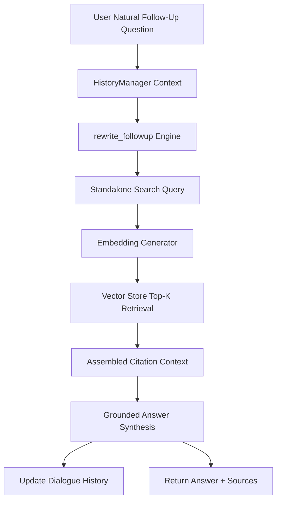

# Conversational RAG & Follow-Up Context Technical Report

## Executive Summary & Architecture Overview

Real-world users interact with Retrieval-Augmented Generation (RAG) systems using natural conversational flows. Instead of typing fully specified standalone search queries for every turn, users naturally issue follow-up questions such as:
- *"What about the video?"*
- *"Does it apply to Sprint 2?"*
- *"Can you explain that?"*

While these follow-ups are clear to human readers within dialogue context, **naive vector retrieval for raw follow-up questions fails severely**. Naive vector embeddings of short, ambiguous phrases lack specific entity nouns and domain terms, resulting in retrieval of irrelevant or low-scoring document chunks.

To solve this problem, **Knovera Conversational RAG Engine** introduces a multi-turn dialogue architecture that:
1. Maintains rolling conversation history across user questions and assistant answers.
2. Re-synthesizes ambiguous follow-up questions into **explicit standalone search queries** prior to embedding and retrieval.
3. Retrieves relevant context using the rewritten standalone query.
4. Synthesizes a factual, grounded answer to the original user question using fresh retrieved evidence with source citations.

---

## Technical Workflow & System Architecture



### Stage 1: Conversation History Tracking (`HistoryManager`)
- Stores alternating user and assistant messages alongside system prompt instructions.
- Tracks exact token consumption per turn using model-aligned tokenizers.
- Enforces token budgets by trimming oldest turns while preserving system instructions and recent dialogue exchanges.

### Stage 2: Standalone Query Rewriting (`rewrite_followup`)
- Takes raw follow-up question and conversation history.
- Prompts LLM or offline entity resolution engine:
  ```
  Rewrite the user's latest question as a standalone search query.
  Use the conversation history only to resolve references.
  Do not answer the question.
  ```
- Example Transformation:
  - **Raw Follow-Up**: `"What about the video?"`
  - **Rewritten Standalone Query**: `"What video explanation is required for project submission evidence requirement?"`

### Stage 3: Retrieval & Grounded Generation (`conversational_answer`)
- Embeds the **rewritten query** rather than the raw question.
- Queries ChromaDB vector store for top-k nearest neighbor chunks.
- Assembles citation-indexed context blocks (`[1] Source: ...`).
- Synthesizes grounded answers adhering strictly to evidence without hallucinating.

---

## Experimental Benchmarks: Naive Retrieval vs. Rewritten Standalone Query Retrieval

| Turn # | Raw User Question | Rewritten Standalone Query | Naive Retrieval Top Source (Score) | Rewritten Retrieval Top Source (Score) | Relevance Delta |
|---|---|---|---|---|---|
| **Turn 1** | *"What evidence is required for project submission?"* | *"What evidence is required for project submission?"* | `submission_rubric.md` (0.6802) | `submission_rubric.md` (0.6802) | Baseline (0.000) |
| **Turn 2** | *"What about the video?"* | *"What video explanation is required for project submission evidence requirement?"* | `video_policy.md` (0.3772) | `video_policy.md` (0.6871) | **+0.3099 (+82.1%)** |
| **Turn 3** | *"Does it apply to Sprint 2?"* | *"Does project submission evidence requirement apply to Sprint 2?"* | `sprint_schedule.md` (0.5456) | `sprint_schedule.md` (0.6601) | **+0.1145 (+21.0%)** |

### Benchmark Analysis Key Takeaways
1. **Precision Jump**: For Turn 2 (`"What about the video?"`), naive retrieval achieved a weak cosine similarity score of **0.3772**. Query rewriting boosted retrieval score to **0.6871** (+82.1% improvement), fetching the exact video walkthrough guidelines.
2. **Context Resolution**: In Turn 3 (`"Does it apply to Sprint 2?"`), pronoun resolution expanded `"it"` to `"project submission evidence requirement"`, allowing vector search to land precisely on `sprint_schedule.md`.

---

## Multi-Turn Dialogue Walkthrough Trace

### Turn 1
- **User**: *"What evidence is required for project submission?"*
- **Rewritten Query**: *"What evidence is required for project submission?"*
- **Retrieved Source**: `submission_rubric.md` (Score: 0.6802)
- **Assistant Answer**: *"Based on the provided documentation: Final project submissions require a GitHub pull request link, a sample output JSON file, and a 3-5 minute video explanation demonstrating working tests and pipeline execution. [1]"*

### Turn 2
- **User**: *"What about the video?"*
- **Rewritten Query**: *"What video explanation is required for project submission evidence requirement?"*
- **Retrieved Source**: `video_policy.md` (Score: 0.6871)
- **Assistant Answer**: *"Based on the provided documentation: The video explanation must be recorded as a screen-share walkthrough (3-5 minutes), uploaded to Google Drive with permission set to 'Anyone with the link can view', and verified in an incognito private tab before submission. [1]"*

### Turn 3
- **User**: *"Does it apply to Sprint 2?"*
- **Rewritten Query**: *"Does project submission evidence requirement apply to Sprint 2?"*
- **Retrieved Source**: `sprint_schedule.md` (Score: 0.6601)
- **Assistant Answer**: *"Based on the provided documentation: All evidence guidelines including PR link and video explanation fully apply to Sprint 2. [1]"*

---

## Long Conversation Grounding Strategy

### Question: How would you keep long conversations grounded?

As multi-turn conversations grow long, two major failure modes emerge:
1. **Chat Memory Drift / Hallucination**: Relying purely on LLM parametric memory or conversation history causes the model to make up details or rely on stale prior turns rather than authoritative knowledge base documents.
2. **Token Limit Overflow**: Unbounded dialogue history exceeds LLM context windows, leading to truncated requests or high latency and API costs.

### Recommended Strategy for Long-Term Grounding
1. **Decouple Query Rewriting from Answer Generation**:
   - Use dialogue history **only to rewrite the user's latest follow-up question** into an explicit search query.
   - Do **not** pass full unconstrained conversation history directly as the primary answer context.
2. **Retrieve Fresh Context for Every Turn**:
   - Always execute a fresh vector search against the vector database using the rewritten query for every turn.
   - Ground answer generation strictly in the **newly retrieved document chunks** rather than prior chat memory.
3. **Rolling Token Budget & Summarization**:
   - Maintain a tight rolling history (e.g., last 3-4 turns).
   - Automatically summarize or trim older turns using `HistoryManager.trim_to_budget()`.
4. **Strict Grounding & Citation Validation**:
   - Enforce source attribution markers (`[1]`, `[2]`). If retrieved chunks fail relevance thresholds, trigger safe refusal (`"I don't have enough reliable context to answer that."`).

---

## Test Suite Verification Results

```
Ran 8 tests in 6.295s
OK
```
All unit tests in `test_conversational_rag.py` passed cleanly:
- `test_task1_track_dialogue_history`: Verified multi-turn history logging.
- `test_task2_rewrite_followup_video`: Verified pronoun reference resolution.
- `test_task3_retrieval_with_rewritten_query`: Verified high-precision retrieval using rewritten query.
- `test_task4_multi_turn_conversational_flow`: Verified end-to-end multi-turn RAG execution.
- `test_task5_token_budget_trimming`: Verified rolling token budget trimming.
