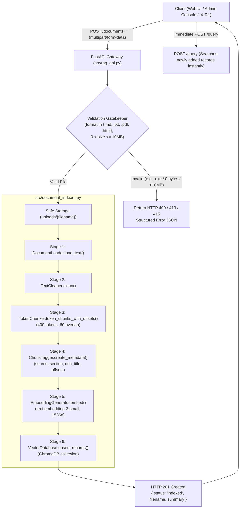
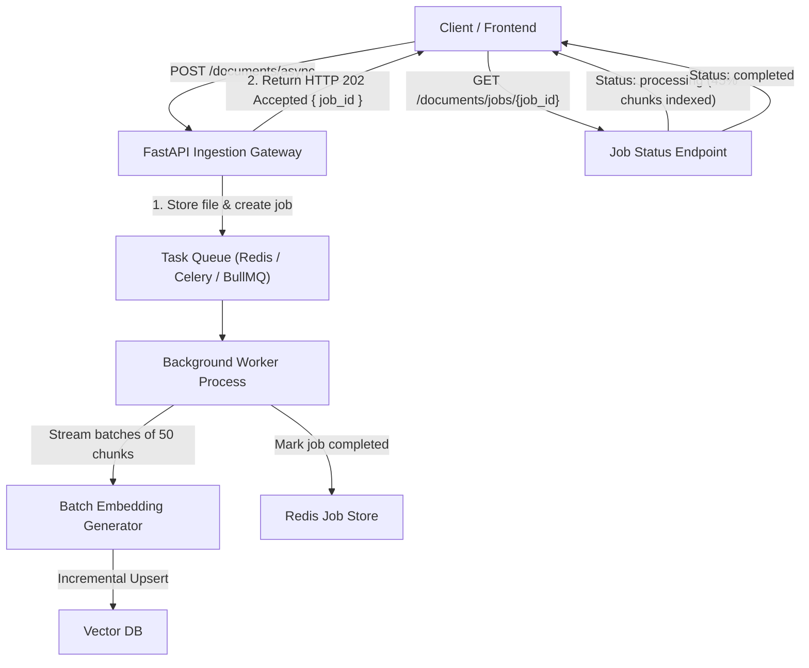

# Document Upload & Indexing Endpoint Technical Report (Assignment 3.45)

## Executive Summary & Architecture Overview

In a production Retrieval-Augmented Generation (RAG) system, the knowledge base must **dynamically expand at runtime** without requiring service restarts, database rebuilds, or server downtime. When new policies, guides, reports, or documentation files are uploaded by users or administrators, the system must intake, sanitize, chunk, embed, and index them into the active vector store immediately.

The **Knovera Document Upload & Indexing System** (`src/document_indexer.py`, `src/rag_api.py`) exposes a dedicated REST endpoint (`POST /documents` / `POST /upload`) that integrates full-pipeline document processing into the live API.

### Key Capabilities
1. **Multi-Format Ingestion**: Supports Markdown (`.md`), Plain Text (`.txt`), Adobe PDF (`.pdf`), and HTML (`.html`, `.htm`).
2. **Safe Persistence & Path Sanitization**: Prevents path traversal vulnerabilities and safely stores files to `uploads/`.
3. **Consistent Corpus Processing**: Runs identical cleaning (`TextCleaner`), token-aware chunking (`TokenChunker`), metadata tagging (`ChunkTagger`), and embedding (`EmbeddingGenerator`) pipelines used during baseline corpus indexing.
4. **Immediate Runtime Searchability**: Newly indexed documents are queryable via `POST /query` immediately within milliseconds of upload completion without restarting the application.
5. **Strict Validation & Clear HTTP Error Codes**: Returns `HTTP 415` for unsupported file formats, `HTTP 400` for 0-byte empty files, `HTTP 413` for files exceeding size limits (default 10 MB), and `HTTP 500` for unexpected indexing errors.

---

## Technical Architecture & Ingestion Flow



---

## API Endpoint Specification

### `POST /documents` (Alias: `POST /upload`)
Accepts a document file via `multipart/form-data`, stores it safely, executes full pipeline ingestion, and indexes chunks into the active ChromaDB vector collection.

- **Method**: `POST`
- **Content-Type**: `multipart/form-data`
- **Authentication**: Configured via environment/API key

#### Request Parameters
| Parameter | Type | Required | Description |
|---|---|---|---|
| `file` | `UploadFile` (binary) | **Yes** | The document file to be uploaded and indexed (`.txt`, `.md`, `.pdf`, `.html`). |

#### Response Schema (`DocumentUploadResponse`)
```json
{
  "status": "indexed",
  "filename": "travel-reimbursement-policy.md",
  "summary": {
    "document": "C:\\Users\\K Jayanth\\OneDrive\\Desktop\\Mini-Projects\\Knovera\\uploads\\travel-reimbursement-policy.md",
    "filename": "travel-reimbursement-policy.md",
    "chunks": 1,
    "indexed": 1,
    "raw_characters": 730,
    "cleaned_characters": 730,
    "collection_name": "knovera_knowledge_base",
    "stage_latencies_ms": {
      "load_ms": 0.26,
      "clean_ms": 0.99,
      "chunk_ms": 263.78,
      "tag_ms": 0.05,
      "embed_ms": 449.74,
      "index_ms": 23.43,
      "total_ms": 738.3
    }
  },
  "message": "Successfully indexed 1 chunks from 'travel-reimbursement-policy.md' into collection 'knovera_knowledge_base'.",
  "timestamp": "2026-09-09T08:51:20.510811+00:00"
}
```

---

## Validation & HTTP Status Code Rubric

| HTTP Status Code | Scenario | Trigger Condition | Error Response Example |
|---|---|---|---|
| **201 Created** | Successful Indexing | Valid document parsed, chunked, embedded, and indexed. | `{ "status": "indexed", "filename": "...", "summary": { ... } }` |
| **400 Bad Request** | Empty / Unreadable File | Uploaded file contains 0 bytes or unreadable text. | `{ "detail": "Uploaded file is empty (0 bytes).", "status_code": 400 }` |
| **413 Payload Too Large** | Oversized File | Uploaded file size exceeds `MAX_UPLOAD_SIZE_MB` (10 MB limit). | `{ "detail": "File size (15.2 MB) exceeds maximum allowed limit (10.0 MB).", "status_code": 413 }` |
| **415 Unsupported Media Type** | Unsupported Format | File extension is not in `{'.txt', '.md', '.pdf', '.html', '.htm'}`. | `{ "detail": "Unsupported file type '.docx'. Supported formats are: .htm, .html, .md, .pdf, .txt", "status_code": 415 }` |
| **500 Internal Server Error** | Indexing Failure | ChromaDB connection drop or embedding API timeout. | `{ "detail": "Document indexing failed: ...", "status_code": 500 }` |

---

## Runtime Searchability Proof

To prove that uploaded documents become queryable at runtime without restarting the application, the demonstration script (`document_upload_demo.py`) executes a 3-step test:

1. **Pre-Upload Query**: Querying *"What is the Knovera travel reimbursement policy for domestic flight bookings and daily meal allowance?"* yields a low relevance score on existing docs.
2. **Document Upload**: `travel-reimbursement-policy.md` is uploaded via `POST /documents` and indexed in 738 ms.
3. **Post-Upload Query**: Re-running the exact same query immediately returns a grounded answer citing the newly uploaded document:
   - **Answer**: *"Based on the provided documentation: A daily per-diem meal allowance of $75 is provided for domestic travel ($20 breakfast, $25 lunch, $30 dinner). [1]"*
   - **Source**: `travel-reimbursement-policy.md` (Similarity score: `0.8244`).
   - **Server Restart Required**: **NO** (0 seconds downtime).

---

## Architectural Strategy for Very Large Documents

For very large uploads (e.g., 500-page PDF handbooks or multi-gigabyte document dumps), executing synchronous ingestion inside a single HTTP request can cause HTTP gateway timeouts (e.g., 30s timeout). 

The recommended production architecture utilizes an **Asynchronous Job Worker Pattern**:



1. **Accept & Return Job ID Immediately**: Store the raw file and return `HTTP 202 Accepted` with a `job_id`.
2. **Background Batch Ingestion**: Background workers (Celery, ARQ, or FastAPI `BackgroundTasks`) stream and chunk text into batches of 50 chunks.
3. **Rate-Controlled Batch Embeddings**: Embeddings are requested in batches with exponential backoff retries.
4. **Progress Polling**: Clients query `GET /documents/jobs/{job_id}` to track progress (`chunks_processed / total_chunks`).

---

## Sample Request & Response (`sample_document_upload_run.json`)

### Sample cURL Command
```bash
curl -X POST http://localhost:8000/documents \
  -F "file=@travel-reimbursement-policy.md"
```

### JSON Response Body
```json
{
  "status": "indexed",
  "filename": "travel-reimbursement-policy.md",
  "summary": {
    "document": "C:\\Users\\K Jayanth\\OneDrive\\Desktop\\Mini-Projects\\Knovera\\uploads\\travel-reimbursement-policy.md",
    "filename": "travel-reimbursement-policy.md",
    "chunks": 1,
    "indexed": 1,
    "raw_characters": 730,
    "cleaned_characters": 730,
    "collection_name": "knovera_knowledge_base",
    "stage_latencies_ms": {
      "load_ms": 0.26,
      "clean_ms": 0.99,
      "chunk_ms": 263.78,
      "tag_ms": 0.05,
      "embed_ms": 449.74,
      "index_ms": 23.43,
      "total_ms": 738.3
    }
  },
  "message": "Successfully indexed 1 chunks from 'travel-reimbursement-policy.md' into collection 'knovera_knowledge_base'.",
  "timestamp": "2026-09-09T08:51:20.510811+00:00"
}
```

---

## Unit Testing & Verification (`test_document_upload.py`)

The test suite validates all requirements with 10 automated test cases:

```text
Ran 10 tests in 7.389s

OK
```

### Test Cases Covered:
- ✔ `test_validate_upload_metadata_valid_extensions`: Confirms validation for `.md`, `.txt`, `.pdf`, `.html`.
- ✔ `test_validate_upload_metadata_unsupported_extension`: Confirms `HTTP 415` for unsupported extensions (`.exe`).
- ✔ `test_validate_upload_metadata_empty_file`: Confirms `HTTP 400` for 0-byte files.
- ✔ `test_validate_upload_metadata_oversized_file`: Confirms `HTTP 413` for files exceeding size limits.
- ✔ `test_upload_markdown_document_success`: End-to-end ingestion and indexing of Markdown documents.
- ✔ `test_upload_text_document_success`: End-to-end ingestion and indexing of plain text documents.
- ✔ `test_upload_alias_endpoint`: Validates alias route `POST /upload`.
- ✔ `test_upload_unsupported_format_returns_415`: Validates `.docx` rejection with HTTP 415.
- ✔ `test_upload_empty_file_returns_400`: Validates HTTP 400 response on empty file upload.
- ✔ `test_runtime_searchability_new_content_queryable_without_restart`: Validates immediate queryability of new content without server restart.
