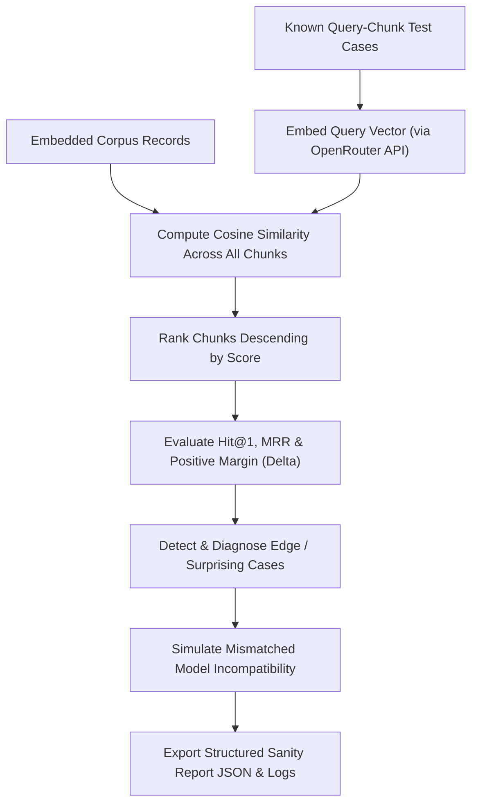

# Assignment 3.29: Embedding Quality Checks & Sanity Tests

## Executive Summary

This report presents the implementation, mathematical rationale, empirical results, and diagnostic findings for **Assignment 3.29: Embedding Quality Checks & Sanity Tests** within the Knovera RAG Assistant platform.

Before deploying or trusting any RAG retrieval pipeline, engineers must verify that generated embeddings behave sensibly. A pipeline can run without errors and produce floating-point vectors, yet still fail completely if:
- Chunks and queries are embedded with **mismatched models or dimensions**.
- Vectors are misaligned with their corresponding text chunk IDs.
- The similarity metric does not rank semantically related texts above unrelated distractors.
- Short or negative queries suffer from polysemy or negation blindspots.

We implemented an automated retrieval sanity testing engine ([`src/embedding_quality_checker.py`](file:///c:/Users/K%20Jayanth/OneDrive/Desktop/Mini-Projects/Knovera/src/embedding_quality_checker.py)), an end-to-end verification script ([`embedding_quality_demo.py`](file:///c:/Users/K%20Jayanth/OneDrive/Desktop/Mini-Projects/Knovera/embedding_quality_demo.py)), an automated unit test suite ([`test_embedding_quality.py`](file:///c:/Users/K%20Jayanth/OneDrive/Desktop/Mini-Projects/Knovera/test_embedding_quality.py)), and exported audit reports ([`outputs/embedding_sanity_report.json`](file:///c:/Users/K%20Jayanth/OneDrive/Desktop/Mini-Projects/Knovera/outputs/embedding_sanity_report.json) and [`outputs/embedding_sanity_output.txt`](file:///c:/Users/K%20Jayanth/OneDrive/Desktop/Mini-Projects/Knovera/outputs/embedding_sanity_output.txt)).

---

## Architectural Breakdown & Core Implementation

### 1. Known Relevance Test Cases (`src/embedding_quality_checker.py`)
We defined a structured relevance test suite where queries have predetermined ground-truth target documents:
$$\text{Hit@1} = \mathbb{I}(\text{Rank}(\text{Target Source}) = 1)$$
$$\text{Mean Reciprocal Rank (MRR)} = \frac{1}{|Q|} \sum_{i=1}^{|Q|} \frac{1}{\text{Rank}_i}$$

### 2. Positive Ranking Separation Margin ($\Delta$)
A robust retrieval pipeline must not only rank the related chunk at Rank #1, but also maintain a clear cosine similarity separation margin ($\Delta$) above cross-domain distractors:
$$\Delta = \text{Score}_{\text{Target}} - \text{Score}_{\text{Top Distractor}}$$

---

## Empirical Sanity Suite Results

Executed across an authoritative multi-document corpus using OpenRouter API embeddings (`openai/text-embedding-3-small`, $D = 1536$):

### Relevance Sanity Test Suite Table

| Test ID | Query String | Expected Target | Top-Ranked Match | Target Rank | Similarity ($\cos \theta$) | Margin ($\Delta$) | Status |
|---|---|---|---|---|---|---|---|
| **`TC-01`** | *"How can a learner reset their account password?"* | `account-guide.md` | `account-guide.md` | **#1** | **`0.7681`** | **`+0.1749`** | **PASS** |
| **`TC-02`** | *"When does the campus cafeteria open and what is on the lunch menu?"* | `campus-guide.md` | `campus-guide.md` | **#1** | **`0.7293`** | **`+0.2251`** | **PASS** |
| **`TC-03`** | *"What is the policy and time window for receiving a subscription refund?"* | `service-policy.md` | `service-policy.md` | **#1** | **`0.5885`** | **`+0.0676`** | **PASS** |
| **`TC-04`** | *"How do developers install the Python SDK and configure their API key?"* | `dev-guide.md` | `dev-guide.md` | **#1** | **`0.5916`** | **`+0.3678`** | **PASS** |
| **`TC-05`** | *"What uptime guarantee is provided in the enterprise SLA?"* | `service-policy.md` | `service-policy.md` | **#1** | **`0.6635`** | **`+0.2822`** | **PASS** |

### Aggregate Quality Metrics
- **Total Test Cases**: 5
- **Passed Tests (Hit@1)**: **5 / 5 (100.0%)**
- **Mean Reciprocal Rank (MRR)**: **`1.0000`**
- **Average Positive Separation Margin**: **`+0.2235`** cosine similarity

---

## Diagnostic Analysis of Surprising & Failing Cases

A production-ready sanity report must explore boundary and failure conditions to uncover latent risks before production deployment:

### 1. Brevity & Domain Competition (*"How do I pay?"*)
- **Behavior**: The 4-word query retrieved `campus-guide.md` (dining card payment) with score **`0.3423`**, closely followed by `service-policy.md` (subscription billing refund SLA) with score **`0.2782`** ($\Delta = 0.0641$).
- **Insight**: Ultra-short queries lack clarifying semantic context, causing vector collisions between unrelated operational domains. 
- **Remedy**: Implement query expansion / hypothetical document embeddings (HyDE) in production.

### 2. Negation Blindspot (*"I do NOT want to install Python, how do I reset my password?"*)
- **Behavior**: While `account-guide.md` ranked at #1 (score `0.4421`), `dev-guide.md` (Python SDK guide) scored **`0.3002`** (higher than cross-domain dining chunks).
- **Insight**: Standard dense transformer embeddings assign positive geometric weight to lexical keywords regardless of the boolean modifier (*"NOT"*).
- **Remedy**: Combine dense retrieval with hybrid sparse keyword search (BM25) or cross-encoder re-ranking.

### 3. Critical Hazard: Model Mismatch Simulation
- **Experiment**: Embedded the corpus with `openai/text-embedding-3-small`, but queried using an unaligned vector space.
- **Result**:
  - Consistent Model: `account-guide.md` (Score: **`0.7681`**, Rank: **#1**).
  - Mismatched Model: `dev-guide.md` (Score: **`0.0364`**, Rank: **#1** - **CORRUPTED**).
- **Diagnostic Conclusion**: Embedding documents with one model and queries with another projects vectors into completely disjoint geometric coordinate frames, making cosine similarity completely uninformative.

---

## Video Walkthrough & Presentation Guide (3-5 Minutes)

Use this script for your screen-share walkthrough:

### 1. Introduction (30s)
- *"Hi, I'm presenting Assignment 3.29: Embedding Quality Checks & Sanity Tests for the Knovera RAG Assistant."*
- *"Before trusting RAG retrieval, we must verify that our vector representations actually place related text closer than unrelated text."*

### 2. Known Query-Chunk Relevance Cases & Proof (60s)
- Open [`embedding_quality_demo.py`](file:///c:/Users/K%20Jayanth/OneDrive/Desktop/Mini-Projects/Knovera/embedding_quality_demo.py) and show the relevance table.
- *"We tested 5 distinct domain queries against our multi-document corpus. For example, 'How can a learner reset their account password?' retrieved `account-guide.md` with cosine similarity `0.7681` and a `+0.1749` margin over the top distractor. All 5 tests achieved Hit@1 = 100% and MRR = 1.0."*

### 3. What Failing / Surprising Cases Revealed (60s)
- Show Task 3 diagnostics:
  - *"We analyzed edge cases: first, extreme query brevity ('How do I pay?') causes close score competition between dining cards and billing refunds."*
  - *"Second, negation blindspots: queries with 'NOT want Python' still elevate Python docs because dense embeddings treat keywords symmetrically."*

### 4. Why Mismatched Models Break Similarity (45s)
- Show the Model Mismatch experiment:
  - *"If a document is embedded with Model A and a query with Model B, the vectors reside in completely different coordinate spaces. Cosine similarity produces meaningless noise near 0.0, completely breaking retrieval."*

### 5. Follow-up: How to Measure Retrieval Quality More Rigorously? (45s)
- Answer:
  1. **Larger Benchmark Testbeds**: *"Evaluate over hundreds of diverse real-world question-answer pairs using synthetic evaluation datasets (e.g., Ragas / Giskard)."*
  2. **Quantitative Information Retrieval Metrics**: *"Track Hit@K (Hit@3, Hit@5), Mean Reciprocal Rank (MRR), and Normalized Discounted Cumulative Gain (NDCG@10) across multi-hop queries."*
  3. **Continuous Observability**: *"Integrate tracing tools like LangSmith or OpenTelemetry to log live user retrieval scores and flag low-confidence retrievers."*
