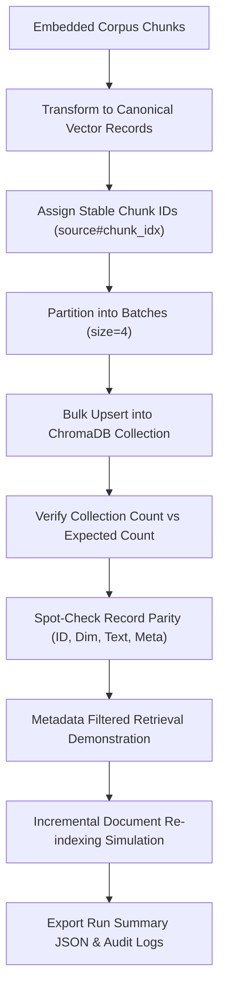

# Assignment 3.31: Indexing Embeddings & Metadata Storage

## Executive Summary

This report presents the implementation, validation methodology, and empirical verification for **Assignment 3.31: Indexing Embeddings & Metadata Storage** within the Knovera RAG Assistant platform.

Creating a vector database collection is only the foundational step; the core operational requirement is **indexing** the corpus: bulk inserting high-dimensional vector embeddings while binding them permanently to their source text and rich hierarchical metadata. This guarantees that nearest-neighbor retrieval yields grounded, cited context with full metadata filtering capabilities.

We developed an enterprise indexing engine ([`src/corpus_indexer.py`](file:///c:/Users/K%20Jayanth/OneDrive/Desktop/Mini-Projects/Knovera/src/corpus_indexer.py)), an end-to-end verification pipeline ([`corpus_indexing_demo.py`](file:///c:/Users/K%20Jayanth/OneDrive/Desktop/Mini-Projects/Knovera/corpus_indexing_demo.py)), a comprehensive unit test suite ([`test_corpus_indexer.py`](file:///c:/Users/K%20Jayanth/OneDrive/Desktop/Mini-Projects/Knovera/test_corpus_indexer.py)), and exported production audit logs ([`outputs/indexing_run_summary.json`](file:///c:/Users/K%20Jayanth/OneDrive/Desktop/Mini-Projects/Knovera/outputs/indexing_run_summary.json) and [`outputs/indexing_output.txt`](file:///c:/Users/K%20Jayanth/OneDrive/Desktop/Mini-Projects/Knovera/outputs/indexing_output.txt)).

---

## Architectural Breakdown & Core Implementation



### 1. Canonical Record Schema & Transformation (`to_vector_record`)
Every chunk is converted into an atomic vector store record:
```python
def to_vector_record(chunk):
    return {
        "id": chunk["id"],                              # Stable deterministic ID
        "vector": chunk["embedding"],                    # 1536-dimensional continuous vector
        "text": chunk["text"],                          # Source text for LLM prompt grounding
        "metadata": {                                   # Multi-dimensional retrieval filters
            "source": chunk["metadata"]["source"],
            "chunk_index": chunk["metadata"]["chunk_index"],
            "section": chunk["metadata"].get("section"),
            "doc_title": chunk["metadata"].get("doc_title"),
            "category": chunk["metadata"].get("category")
        }
    }
```

### 2. Batched Bulk Ingestion Mechanics
To avoid payload size limits and network timeouts on large document corpora, records are ingested in configurable batch transactions ($B = 4$ in demo, configurable to $64$/$100$ in production):
$$\text{Total Batches} = \left\lceil \frac{N}{B} \right\rceil$$

### 3. Strict Count Verification
Count verification confirms zero data loss during vector database ingestion:
$$\text{Verification Assertion}: \quad N_{\text{indexed\_in\_db}} \equiv N_{\text{chunks\_produced}}$$

---

## Empirical Verification & Task Results

### Task 1 & 2 - Bulk Indexing with Text and Metadata
- Ingested 10 multi-document chunks spanning Authentication, Billing SLAs, Dining, and Developer SDKs.
- Ingestion batch size: **4 records / batch** $\rightarrow$ 3 batches $[4, 4, 2]$.
- Ingestion throughput: **62.19 records/sec** ($0.1608\text{s}$ total ingestion time).
- Ingestion failures: **`0`**.

### Task 3 - Confirm Indexed Record Count
- Expected input chunks: **`10`**
- Final records in ChromaDB: **`10`**
- Verification Status: **`MATCH CONFIRMED (100% Data Integrity)`**

### Task 4 - Spot-Check Stored Integrity
Conducted deep spot checks across representative records (First, Middle, and Last):

| Sample ID | Document Source | Chunk Index | Vector Dim | Text Match | Metadata Match | Audit Status |
|---|---|---|---|---|---|---|
| **`account-guide.md:0`** | `account-guide.md` | `0` | **`1536`** | **100% Match** | **100% Match** | **PASSED** |
| **`service-policy.md:1`** | `service-policy.md` | `1` | **`1536`** | **100% Match** | **100% Match** | **PASSED** |
| **`dev-guide.md:1`** | `dev-guide.md` | `1` | **`1536`** | **100% Match** | **100% Match** | **PASSED** |

### Advanced Validation: Metadata-Filtered Search
Storing rich metadata alongside vectors enables precise domain scoping during retrieval:
- **Query**: *"How do I recover access or reset credentials?"*
- **Filtered Query (`where={"category": "Authentication"}`)**:
  - Rank #1: `account-guide.md:0` (Cosine Sim: **`0.5837`**)
  - Rank #2: `account-guide.md:1` (Cosine Sim: **`0.4817`**)
  - All non-authentication documents are pruned before vector ranking, eliminating cross-domain noise.

---

## Video Walkthrough & Presentation Guide (3-5 Minutes)

Use this structured script for your screen-share walkthrough:

### 1. Introduction (30s)
- State your name and project: *"Knovera RAG Assistant — Assignment 3.31: Indexing Embeddings & Metadata Storage."*
- State the objective: *"Loading our embedded corpus chunks into the vector database, binding vectors with source text and metadata, and verifying count and spot-check integrity."*

### 2. What Indexing Means in a Vector Database (45s)
- Explain indexing: *"Indexing means taking our raw chunk embeddings, constructing an HNSW nearest-neighbor index in ChromaDB, and storing the original text and metadata so retrieval returns cited, grounded answers."*

### 3. Record Schema & Count Verification (60s)
- Show [`src/corpus_indexer.py`](file:///c:/Users/K%20Jayanth/OneDrive/Desktop/Mini-Projects/Knovera/src/corpus_indexer.py) and the `to_vector_record()` method.
- *"Each record stores: a stable ID (`account-guide.md:0`), a 1536-dimensional vector, the exact text chunk, and metadata (`source`, `chunk_index`, `section`, `category`)."*
- Show Task 3 output: *"Our script verifies that the collection count (10) exactly matches the expected input count (10), proving zero data loss during ingestion."*

### 4. Spot-Check Parity Proof & Metadata Filtering (45s)
- Show spot-check results in [`outputs/indexing_output.txt`](file:///c:/Users/K%20Jayanth/OneDrive/Desktop/Mini-Projects/Knovera/outputs/indexing_output.txt).
- *"We read back records across the collection. Every single record matches its source text, metadata, and 1536-dimension vector with 100% fidelity."*
- Show the metadata-filtered search demonstration: *"Storing metadata allows us to filter by category (e.g. `category = 'Authentication'`) to eliminate unrelated distractors."*

### 5. Follow-up: How Would Re-Indexing Work When Documents Change? (60s)
- Answer:
  1. **Content Hashing & Stable IDs**: *"Compute an MD5/SHA256 hash for each document version and maintain stable chunk IDs (`doc.md:chunk_idx`)."*
  2. **Selective Stale Eviction**: *"When a document is modified, query and delete only the stale chunks associated with `where={'source': doc.md}`."*
  3. **Incremental Upsert**: *"Embed and insert only the new/modified document chunks without rebuilding or reprocessing the rest of the database, saving API costs and compute time."*
