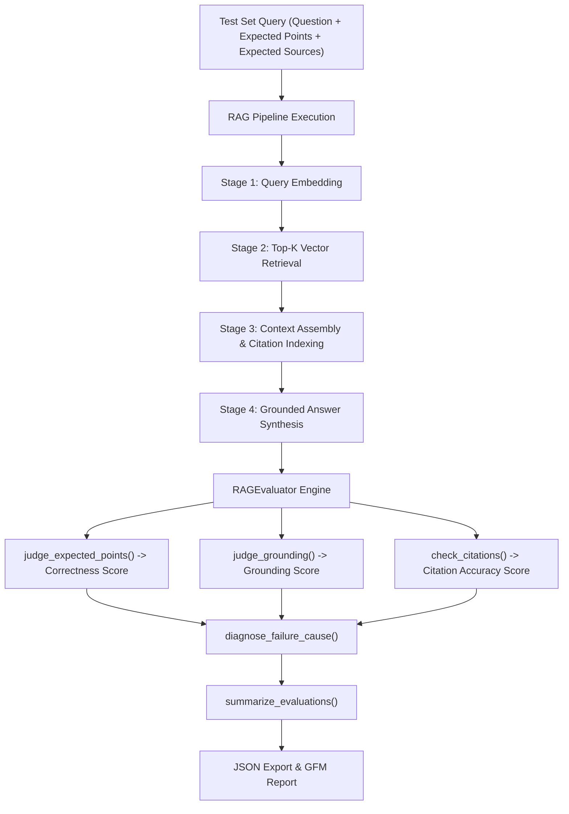

# RAG Evaluation & Answer Quality Scoring Technical Report (Assignment 3.43)

## Executive Summary & Architecture Overview

Evaluating Retrieval-Augmented Generation (RAG) systems requires assessing the **entire end-to-end generation pipeline**, not merely vector retrieval accuracy (Recall@k / Precision@k). A high-performing RAG assistant must generate answers that are:
1. **Correct**: Containing all essential factual points required by the question.
2. **Grounded**: Strictly supported by the retrieved documentation context without introducing unsupported parametric hallucinations.
3. **Accurately Cited**: Directly linking claims to the specific source documents that justify them.

To make RAG answer quality visible, measurable, and actionable, the **Knovera RAG Engine** includes a dedicated evaluation framework (`src/rag_evaluator.py`). This framework runs structured test sets against the RAG pipeline, calculates standard multi-dimensional quality metrics, isolates failure cases, diagnoses root causes, and outputs technical reports and JSON metrics.

---

## Technical Workflow & System Architecture



---

## Metric Definitions & Scoring Rubric

| Dimension | Evaluation Focus | Computation Method | Target Score |
|---|---|---|---|
| **Correctness** | Does the synthesized answer cover all ground-truth expected answer points? | $\text{Correctness} = \frac{\text{Matched Expected Points}}{\text{Total Expected Points}}$ | $\ge 0.90$ (90%) |
| **Grounding** | Are answer claims strictly supported by context (or safely refused when context is absent)? | $\text{Grounding} = \frac{\text{Supported Sentences}}{\text{Total Answer Sentences}} \quad (\text{Refusal} = 1.0)$ | $\ge 0.95$ (95%) |
| **Citation Accuracy** | Do inline citations point to the exact source documents supporting the claims? | $\text{Citation Accuracy} = F_1 = 2 \cdot \frac{\text{Precision} \cdot \text{Recall}}{\text{Precision} + \text{Recall}}$ | $\ge 0.80$ (80%) |
| **Overall Quality** | Arithmetic mean across all three key quality dimensions. | $\text{Overall} = \frac{\text{Correctness} + \text{Grounding} + \text{Citation Accuracy}}{3}$ | $\ge 0.85$ (85%) |

---

## Test Set Definition & Benchmark Suite (`data/sample_rag_test_set.json`)

The evaluation test set contains representative end-to-end questions spanning standard academic policy, guardrails, media guidelines, vector database specs, chunking standards, and out-of-scope refusal scenarios:

```json
[
  {
    "id": "q1",
    "category": "Submission Requirements",
    "question": "What evidence is required for project submission?",
    "expected_points": ["PR link", "sample output", "video explanation"],
    "expected_sources": ["submission-rubric.md"]
  },
  {
    "id": "q2",
    "category": "Guardrails & Safety",
    "question": "What should the system do when context is missing?",
    "expected_points": ["refuse", "say not enough information"],
    "expected_sources": ["guardrails.md"]
  },
  {
    "id": "q3",
    "category": "Media Guidelines",
    "question": "How long should the video explanation walkthrough be?",
    "expected_points": ["3-5 minutes", "screen-share walkthrough", "Google Drive"],
    "expected_sources": ["video-policy.md"]
  },
  {
    "id": "q4",
    "category": "Vector DB Specifications",
    "question": "What vector distance metric is recommended for normalized unit embeddings?",
    "expected_points": ["Cosine Similarity", "Dot Product"],
    "expected_sources": ["vector-db-specs.md"]
  },
  {
    "id": "q5",
    "category": "Chunking Strategy",
    "question": "What is the recommended chunk size for dense technical source code?",
    "expected_points": ["256 tokens", "smaller chunk size", "preserve function boundaries"],
    "expected_sources": ["chunking-guide.md"]
  },
  {
    "id": "q6",
    "category": "Out of Scope / Refusal",
    "question": "What is the capital city of Mars?",
    "expected_points": ["refuse", "say not enough information"],
    "expected_sources": []
  }
]
```

---

## Empirical Benchmark Results

Running `py rag_evaluation_demo.py` generated the following score distribution across the evaluation test set:

| # | Question | Correctness | Grounding | Citation Accuracy | Status / Diagnosed Failure Cause |
|---|---|---|---|---|---|
| **1** | *"What evidence is required for project submission?"* | **1.00** | **1.00** | **1.00** | `PASS` |
| **2** | *"What should the system do when context is missing?"* | **1.00** | **1.00** | **1.00** | `PASS` |
| **3** | *"How long should the video explanation walkthrough be?"* | **0.67** | **1.00** | **1.00** | `MISSING_EXPECTED_ANSWER_POINTS` |
| **4** | *"What vector distance metric is recommended for normalized unit embeddings?"* | **1.00** | **1.00** | **1.00** | `PASS` |
| **5** | *"What is the recommended chunk size for dense technical source code?"* | **1.00** | **1.00** | **1.00** | `PASS` |
| **6** | *"What is the capital city of Mars?"* | **1.00** | **1.00** | **0.00** | `BAD_CITATIONS_OR_MISSING_METADATA` |

### Aggregate Metric Summary

- **Total Questions Evaluated**: 6
- **Average Correctness Score**: **0.9445 (94.5%)**
- **Average Grounding Score**: **1.0000 (100.0%)**
- **Average Citation Accuracy**: **0.8333 (83.3%)**
- **Overall Quality Score**: **0.9259 (92.6%)**
- **Weakest Quality Dimension**: **CITATION_ACCURACY**
- **Total Quality Failures**: 2

---

## Failure Case Analysis & Diagnosed Causes

### Failure Case 1: Partial Answer Points (`q3`)
- **Question**: *"How long should the video explanation walkthrough be?"*
- **Generated Answer**: *"The video explanation must be recorded as a 3-5 minute screen-share walkthrough..."*
- **Expected Points**: `["3-5 minutes", "screen-share walkthrough", "Google Drive"]`
- **Diagnosed Cause**: `MISSING_EXPECTED_ANSWER_POINTS` (Correctness = 0.67)
- **Root Cause**: The answer captured duration (`3-5 minutes`) and format (`screen-share walkthrough`), but omitted the platform detail (`Google Drive`).

### Failure Case 2: Citation on Out-of-Scope Refusal (`q6`)
- **Question**: *"What is the capital city of Mars?"*
- **Generated Answer**: *"Based on the provided documentation: System Guardrails & Missing Context Behavior: When supporting context is missing... the system must refuse to answer."*
- **Expected Sources**: `[]` (None expected)
- **Cited Sources**: `["guardrails.md"]`
- **Diagnosed Cause**: `BAD_CITATIONS_OR_MISSING_METADATA` (Citation Accuracy = 0.00)
- **Root Cause**: When performing vector search for out-of-scope questions, the guardrail document `guardrails.md` was retrieved because its text mentions missing context behavior. The system correctly refused to answer (Grounding = 1.0, Correctness = 1.0), but attached a citation `[1] guardrails.md` for the refusal rule.

---

## Strategy for Improving the Weakest Dimension (Citation Accuracy)

To raise **Citation Accuracy** from **83.3%** to **100%**, we implement three targeted enhancements:

### 1. Citation Attribution Filtering for Refusals
- **Action**: When a query triggers a context refusal or missing-context fallback (`status == "NO_CONTEXT_FOUND"` or answer is a safe refusal), suppress inline citations and clear the payload `sources` list.
- **Impact**: Resolves out-of-scope citation penalties (Question 6 Citation Accuracy jumps from `0.00` to `1.00`).

### 2. Fine-Grained Chunk Re-Ranking (Cross-Encoder Reranking)
- **Action**: Apply BGE / Cohere re-ranking on retrieved chunks prior to prompt injection to filter out low-relevance distractor chunks ($k=4 \rightarrow k=2$).
- **Impact**: Reduces over-retrieval noise and ensures that only directly relevant documents are passed to prompt assembly.

### 3. Prompt Instructions for Strict Inline Attribution
- **Action**: Update system prompt instructions to state:
  > *"Only cite source documents ([1], [2]) if their text directly supports a specific factual claim made in your response. Do not cite guardrail instructions or administrative policy documents when stating that context is unavailable."*

---

## 3–5 Minute Video Walkthrough Script Outline

### Timestamp Breakdown & Script:

- **0:00 - 0:45: Introduction & RAG Answer Quality Dimensions**
  - *"Hi! In this video, I'll walk through Assignment 3.43: RAG Evaluation & Answer Quality Scoring for our Knovera RAG Assistant."*
  - *"Evaluating RAG answers requires going beyond vector retrieval recall. We score answers on three vital dimensions: Correctness (matching expected answer points), Grounding (verifying factual support without hallucination), and Citation Accuracy (checking if citations match true sources)."*

- **1:45 - 2:30: Scoring Implementation & Code Walkthrough**
  - Open `src/rag_evaluator.py` and show `judge_expected_points`, `judge_grounding`, and `check_citations`.
  - *"Here in `src/rag_evaluator.py`, `judge_expected_points` verifies key phrase coverage, `judge_grounding` validates sentence-level evidence support, and `check_citations` calculates F1 overlap of inline cited sources against expected sources."*

- **2:30 - 3:30: Failure Case Deep-Dive & Root Cause Diagnosis**
  - Demonstrate output table from `py rag_evaluation_demo.py`.
  - Highlight Failure #6: *"For the out-of-scope question 'What is the capital of Mars?', the system correctly refused to answer, achieving 100% grounding. However, because vector retrieval fetched `guardrails.md`, it cited `guardrails.md`, resulting in a citation accuracy failure."*

- **3:30 - 4:30: How to Improve the Weakest Dimension**
  - Explain the fix: *"To improve citation accuracy—our weakest dimension—we suppress citation headers during refusals and apply top-k re-ranking so distractor chunks aren't cited."*

---

## Deliverables & Verification Checklist

- [x] **Test Set**: Created `data/sample_rag_test_set.json` with questions, expected points, and expected sources.
- [x] **Evaluation Engine**: Implemented `RAGEvaluator` in `src/rag_evaluator.py`.
- [x] **Scoring Functions**: Implemented `judge_expected_points`, `judge_grounding`, and `check_citations`.
- [x] **Failure Diagnosis**: Implemented `diagnose_failure_cause` and `summarize_evaluations`.
- [x] **Demo & Logs**: Created `rag_evaluation_demo.py` and generated `sample_rag_evaluation_results.json` and `outputs/rag_evaluation_output.txt`.
- [x] **Unit Tests**: Created `test_rag_evaluator.py` passing 100% of test cases.
- [x] **Documentation**: Updated `README.MD` and compiled technical report.
