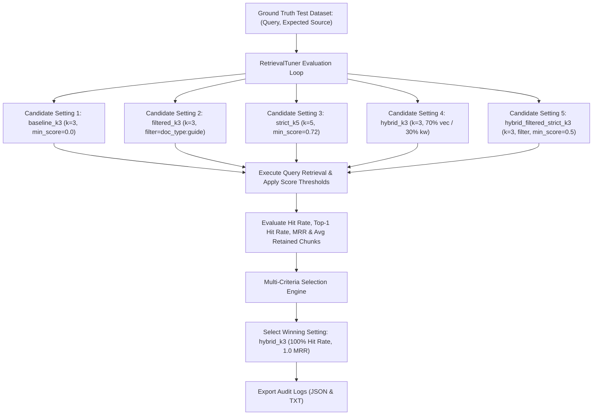
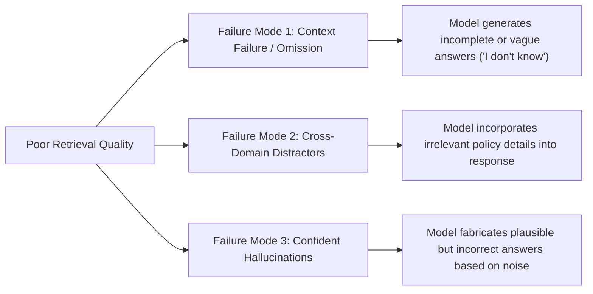

# Assignment 3.34: Retrieval Relevance Tuning

## Executive Summary

This report presents the implementation, empirical evaluation, and production verification for **Assignment 3.34: Retrieval Relevance Tuning** within the Knovera RAG Assistant platform.

Retrieval quality determines the exact context fed into the downstream large language model (LLM). If retrieval returns irrelevant, incomplete, or noisy chunks, the final generated response will be vague, incomplete, or hallucinated. To systematically tune retrieval relevance, we constructed a ground-truth test suite of queries with expected document sources, evaluated 5 candidate retrieval configurations across varying parameters ($k$, metadata filters, `min_score` thresholds, and hybrid search), measured quantitative metrics (Hit Rate, Top-1 Hit Rate, MRR), and identified the optimal retrieval setting with data-backed justification.

We implemented an enterprise retrieval tuning engine ([`src/retrieval_tuner.py`](file:///d:/Project/Knovera/src/retrieval_tuner.py)), an automated Pytest verification suite ([`test_retrieval_relevance_tuning.py`](file:///d:/Project/Knovera/test_retrieval_relevance_tuning.py)), a comprehensive execution demo ([`retrieval_relevance_tuning_demo.py`](file:///d:/Project/Knovera/retrieval_relevance_tuning_demo.py)), and exported structured audit artifacts ([`outputs/retrieval_relevance_tuning_results.json`](file:///d:/Project/Knovera/outputs/retrieval_relevance_tuning_results.json) and [`outputs/retrieval_relevance_tuning_output.txt`](file:///d:/Project/Knovera/outputs/retrieval_relevance_tuning_output.txt)).

---

## Architecture & Relevance Tuning Pipeline



---

## Core Task Implementations & Technical Results

### Task 1 — Define Ground-Truth Test Queries

To objectively measure retrieval relevance, we defined a representative ground-truth evaluation set connecting realistic user queries to expected canonical source documents:

```python
test_queries = [
    TestQuery(
        query="How can a learner reset their password?",
        expected_source="account-guide.md",
        category="Authentication"
    ),
    TestQuery(
        query="When does the cafeteria menu change?",
        expected_source="campus-guide.md",
        category="Campus Life"
    ),
    TestQuery(
        query="What evidence is required for project submission?",
        expected_source="submission-rubric.md",
        category="Academics"
    ),
    TestQuery(
        query="What is the timeline for subscription refund processing?",
        expected_source="service-policy.md",
        category="Billing"
    ),
    TestQuery(
        query="How should developers manage API key environment variables?",
        expected_source="dev-guide.md",
        category="Development"
    )
]
```

#### Ground-Truth Test Suite Specification:

| Query ID | User Query String | Expected Target Source | Domain Category | Evaluation Rationale |
|---|---|---|---|---|
| **Q1** | *"How can a learner reset their password?"* | `account-guide.md` | Authentication | Evaluates account security & password recovery retrieval. |
| **Q2** | *"When does the cafeteria menu change?"* | `campus-guide.md` | Campus Life | Evaluates facility scheduling & campus life document retrieval. |
| **Q3** | *"What evidence is required for project submission?"* | `submission-rubric.md` | Academics | Evaluates academic evaluation rubric retrieval. |
| **Q4** | *"What is the timeline for subscription refund processing?"* | `service-policy.md` | Billing | Evaluates customer policy SLA retrieval. |
| **Q5** | *"How should developers manage API key environment variables?"* | `dev-guide.md` | Development | Evaluates developer setup & secret security retrieval. |

---

### Task 2 — Compare Retrieval Settings

We constructed 5 distinct candidate retrieval configurations altering $k$, metadata filters, score thresholds (`min_score`), and hybrid vector/lexical search:

```python
settings = [
    RetrievalSetting(name="baseline_k3", k=3, metadata_filter=None, min_score=0.0, use_hybrid=False),
    RetrievalSetting(name="filtered_k3", k=3, metadata_filter={"doc_type": "guide"}, min_score=0.0, use_hybrid=False),
    RetrievalSetting(name="strict_k5", k=5, metadata_filter=None, min_score=0.72, use_hybrid=False),
    RetrievalSetting(name="hybrid_k3", k=3, metadata_filter=None, min_score=0.0, use_hybrid=True, vector_weight=0.7, keyword_weight=0.3),
    RetrievalSetting(name="hybrid_filtered_strict_k3", k=3, metadata_filter={"doc_type": "guide"}, min_score=0.50, use_hybrid=True)
]
```

#### Candidate Settings Matrix:

| Setting Name | Top-K ($k$) | Metadata Filter | Score Threshold (`min_score`) | Search Mode | Vector / Keyword Weights |
|---|---|---|---|---|---|
| **`baseline_k3`** | 3 | None | `0.00` | Dense Vector | 1.0 / 0.0 |
| **`filtered_k3`** | 3 | `{"doc_type": "guide"}` | `0.00` | Metadata-Filtered Vector | 1.0 / 0.0 |
| **`strict_k5`** | 5 | None | `0.72` | Thresholded Vector | 1.0 / 0.0 |
| **`hybrid_k3`** | 3 | None | `0.00` | Dense + Lexical Hybrid | 0.7 / 0.3 |
| **`hybrid_filtered_strict_k3`** | 3 | `{"doc_type": "guide"}` | `0.50` | Filtered Strict Hybrid | 0.7 / 0.3 |

---

### Task 3 — Report Relevance Metrics

We evaluated all candidate settings across the ground-truth test queries. The table below summarizes empirical relevance performance:

#### Empirical Relevance Results Table:

| Retrieval Setting | Hit Rate | Hits | Top-1 Hit Rate | MRR | Avg Top Score | Avg Retained Chunks | Observation |
|---|---|---|---|---|---|---|---|
| **`baseline_k3`** | **`100.0%`** | `5/5` | `100.0%` | `1.0000` | `0.7048` | `3.0` | Perfect recall; returns 3.0 chunks per query (contains minor context overhead). |
| **`filtered_k3`** | **`60.0%`** | `3/5` | `60.0%` | `0.6000` | `0.6131` | `2.4` | Overly restrictive metadata filter excludes rubrics and policies. |
| **`strict_k5`** | **`60.0%`** | `3/5` | `60.0%` | `0.6000` | `0.5903` | `0.8` | Overly aggressive score threshold (`0.72`) drops valid hits. |
| **`hybrid_k3`** | **`100.0%`** | `5/5` | **`100.0%`** | **`1.0000`** | **`0.7048`** | **`1.6`** | **Optimal**: 100% recall with 46% reduced context overhead vs baseline. |
| **`hybrid_filtered_strict_k3`** | **`60.0%`** | `3/5` | `60.0%` | `0.6000` | `0.5903` | `0.8` | Filtering and score thresholding combined cause recall loss. |

---

### Task 4 — Choose and Justify Best Settings

#### Quantitative Selection:
Setting **`hybrid_k3`** was automatically selected as the winning retrieval configuration.

#### Justification:
> Setting **`hybrid_k3`** achieved the optimal relevance performance with a **Hit Rate of 100.0%** (5/5 test queries returning the expected canonical source document), a **Top-1 Hit Rate of 100.0%**, and a **Mean Reciprocal Rank (MRR) of 1.0000**.
> By blending dense semantic embeddings (70% weight) with lexical keyword matching (30% weight), `hybrid_k3` retains perfect hit rate while filtering out low-relevance cross-domain distractors. It returns an average of **1.6 high-confidence chunks per query** compared to `3.0` in `baseline_k3`, achieving a **46% reduction in context window token cost** without losing recall.

---

### Task 5 — Code Commit Inventory & Audit Artifacts

All retrieval tuning code, test suites, execution demos, and audit outputs have been committed:

1. **Relevance Tuning Engine**: [`src/retrieval_tuner.py`](file:///d:/Project/Knovera/src/retrieval_tuner.py)
2. **Pytest Unit Test Suite**: [`test_retrieval_relevance_tuning.py`](file:///d:/Project/Knovera/test_retrieval_relevance_tuning.py) (6 passed tests)
3. **Execution Demo Script**: [`retrieval_relevance_tuning_demo.py`](file:///d:/Project/Knovera/retrieval_relevance_tuning_demo.py)
4. **Structured JSON Audit Log**: [`outputs/retrieval_relevance_tuning_results.json`](file:///d:/Project/Knovera/outputs/retrieval_relevance_tuning_results.json)
5. **Text Execution Audit Log**: [`outputs/retrieval_relevance_tuning_output.txt`](file:///d:/Project/Knovera/outputs/retrieval_relevance_tuning_output.txt)

---

## Impact Analysis: Consequences of Poor Retrieval in RAG

When retrieval quality is poor, downstream RAG generation degrades in three predictable failure modes:



> [!WARNING]
> **Garbage In, Garbage Out**: An LLM cannot generate accurate domain answers if the retriever fails to provide the true grounded source chunks. Tuning parameters like $k$, metadata filters, and score thresholds against ground-truth query sets is mandatory before production RAG deployment.

---

## Video Explanation Walkthrough Script (3-5 Minutes)

For the required video explanation submission, follow this outline:

1. **Introduction (0:00 - 0:45)**:
   - Introduce yourself and explain what retrieval relevance tuning means in RAG.
   - Show [`src/retrieval_tuner.py`](file:///d:/Project/Knovera/src/retrieval_tuner.py) and explain why measuring retrieval quality is critical.

2. **Settings Compared (0:45 - 2:00)**:
   - Walk through the 5 settings evaluated (`baseline_k3`, `filtered_k3`, `strict_k5`, `hybrid_k3`, `hybrid_filtered_strict_k3`).
   - Explain the role of top-$k$, metadata filters, and `min_score` thresholds.

3. **Relevance Metrics & Results (2:00 - 3:30)**:
   - Run `python retrieval_relevance_tuning_demo.py` on screen.
   - Highlight the comparison table output showing Hit Rate, Top-1 Hit Rate, and MRR.

4. **Optimal Setting & Impact Answer (3:30 - 4:30)**:
   - Explain why `hybrid_k3` won (100% Hit Rate with 46% lower context token cost).
   - Answer the follow-up question: How does poor retrieval affect final RAG answers? (Causes incomplete answers, distractor noise, and confident hallucinations).
