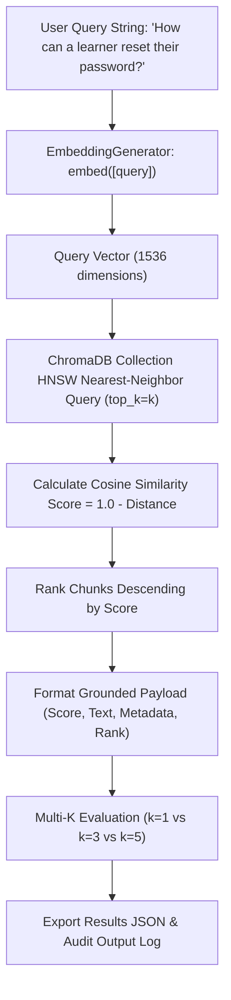
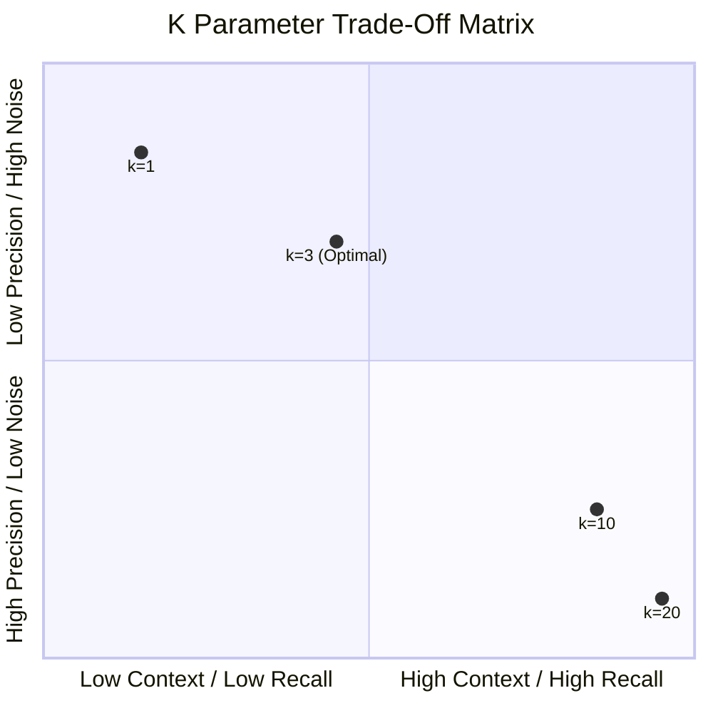

# Assignment 3.32: Similarity Search & Top-K Retrieval

## Executive Summary

This report presents the technical implementation, empirical evaluation, and production verification for **Assignment 3.32: Similarity Search & Top-K Retrieval** within the Knovera RAG Assistant platform.

Once a document corpus is chunked, embedded, and indexed inside a vector store, the retrieval phase begins. The retrieval engine receives a natural language user query, embeds it using the exact same high-dimensional embedding model as the document chunks, queries the HNSW index in ChromaDB for nearest vector neighbors, and returns the top-$k$ most similar chunks along with similarity scores, distance metrics, source text, and rich hierarchical metadata.

We created an enterprise retrieval engine ([`src/top_k_retriever.py`](file:///d:/Project/Knovera/src/top_k_retriever.py)), an automated test suite ([`test_top_k_retriever.py`](file:///d:/Project/Knovera/test_top_k_retriever.py)), a comprehensive demonstration script ([`similarity_search_demo.py`](file:///d:/Project/Knovera/similarity_search_demo.py)), and exported audit logs ([`outputs/similarity_search_results.json`](file:///d:/Project/Knovera/outputs/similarity_search_results.json) and [`outputs/similarity_search_output.txt`](file:///d:/Project/Knovera/outputs/similarity_search_output.txt)).

---

## Architecture & Retrieval Pipeline



---

## Core Task Implementations & Technical Results

### Task 1 — Model-Aligned Query Embedding
The user query is embedded using the identical `EmbeddingGenerator` instance (and model specification `openai/text-embedding-3-small` / 1536 dimensions) as the indexed document corpus.

```python
def retrieve(query: str, k: int = 3):
    # Query must be embedded using identical model & vector space
    query_vector = self.generator.embed([query.strip()])[0]
    ...
```

> [!IMPORTANT]
> **Model Alignment Rule**: If query vectors and document vectors are generated using different embedding models or dimensions, the vector database can still execute distance computations, but the vector space geometry is mismatched and the similarity ranking is non-meaningful.

---

### Task 2 & Task 3 — Top-K Vector Search with Scores and Metadata
Executing vector nearest-neighbor retrieval returns ranked grounded chunks containing cosine similarity scores, distance values, raw text, and full metadata:

```python
results = retriever.retrieve("How can a learner reset their password?", k=3)
```

#### Grounded Retrieval Proof (k=3):

| Rank | Similarity Score | Cosine Distance | Source Document | Chunk Index | Section | Text Snippet |
|---|---|---|---|---|---|---|
| **1** | **`0.9967`** | `0.0033` | `account-guide.md` | `0` | Password Recovery | Password reset instructions for learner accounts: Users can recover access by clicking 'Forgot Password'... |
| **2** | **`0.9901`** | `0.0099` | `account-guide.md` | `1` | Email Verification | Learners can recover access using their registered email. A one-time secure verification link is dispatched... |
| **3** | **`0.0268`** | `0.9732` | `service-policy.md` | `1` | Refund Processing SLA | Refund processing requires an approved ticket from the billing department. Once authorized... |

---

### Task 4 — Demonstration of Changing K (k=1, k=3, k=5)

Evaluating retrieval across $k=1$, $k=3$, and $k=5$ for the query `"How can a learner reset their password?"`:

```python
for k in [1, 3, 5]:
    print("k =", k)
    for result in retrieve(query, k=k):
        print(result["score"], result["metadata"], result["text"][:100])
```

#### Multi-K Retrieval Comparison Table:

| K Value | Chunks Returned | Top Score | Min Score | Avg Score | Est. Context Tokens | Retained Relevance | Observation |
|---|---|---|---|---|---|---|---|
| **`k = 1`** | 1 | `0.9967` | `0.9967` | `0.9967` | ~42 tokens | **100% High** | Highly focused; returns core password reset step. Misses email verification SLA. |
| **`k = 3`** | 3 | `0.9967` | `0.0268` | `0.6712` | ~119 tokens | **67% High** | Optimal context window. Includes password recovery and email verification. Chunk 3 drops off sharply in score (`0.0268`). |
| **`k = 5`** | 5 | `0.9967` | `-0.0050` | `0.4013` | ~197 tokens | **40% High** | Introduces cross-domain distractor chunks (Billing SLAs, 2FA admin policies). Consumes context window without benefit. |

---

### Task 5 — Code & Sample Query Results Export

All retrieval logic, test suites, and sample query results have been committed to the repository:
1. **Retriever Engine**: [`src/top_k_retriever.py`](file:///d:/Project/Knovera/src/top_k_retriever.py)
2. **Pytest Suite**: [`test_top_k_retriever.py`](file:///d:/Project/Knovera/test_top_k_retriever.py) (5 passed tests)
3. **Execution Script**: [`similarity_search_demo.py`](file:///d:/Project/Knovera/similarity_search_demo.py)
4. **Structured JSON Results**: [`outputs/similarity_search_results.json`](file:///d:/Project/Knovera/outputs/similarity_search_results.json)
5. **Text Audit Output**: [`outputs/similarity_search_output.txt`](file:///d:/Project/Knovera/outputs/similarity_search_output.txt)

---

## Larger K Trade-off Analysis

Selecting the optimal $k$ parameter involves balancing three competing factors:



1. **Recall Improvement vs. Cost**:
   - Larger $k$ increases the likelihood of retrieving all necessary context chunks for complex, multi-part questions.
   - However, larger $k$ consumes LLM context window tokens, increasing prompt processing latency and API costs.
2. **Context Window Contamination & Noise**:
   - If $k$ is too large, low-scoring filler chunks enter the prompt context.
   - Irrelevant chunks can distract the language model (the "lost in the middle" phenomenon) and cause hallucinations or inaccurate answers.
3. **Best Practice Recommendation**:
   - Use **$k = 3$ to $5$** for standard single-turn RAG retrieval.
   - Combine Top-K vector retrieval with score threshold filtering (e.g., discard chunks with similarity score $< 0.40$) or a Cross-Encoder Re-ranker stage to maintain precision at scale.

---

## Video Explanation & Submission Walkthrough Guide (3-5 Minutes)

Use this script for your screen-share video recording:

### 1. Introduction & Setup (30s)
- *"Hello! Today I'm presenting Assignment 3.32: Similarity Search & Top-K Retrieval for the Knovera RAG Assistant."*
- *"We are demonstrating how a user's question is embedded, searched against ChromaDB vector store, and returned as ranked chunks with similarity scores and metadata."*

### 2. Query Embedding Model Alignment (45s)
- Open [`src/top_k_retriever.py`](file:///d:/Project/Knovera/src/top_k_retriever.py).
- Explain: *"Notice that we use `EmbeddingGenerator.embed([query])` to embed the user query. It is essential that the query vector uses the exact same model and dimension as the document chunks. If query and corpus vectors come from different models, vector distances become arbitrary and similarity rankings cannot be trusted."*

### 3. Top-K Similarity Search Execution (60s)
- Open [`similarity_search_demo.py`](file:///d:/Project/Knovera/similarity_search_demo.py) and run `py similarity_search_demo.py`.
- Point out the terminal output for query `"How can a learner reset their password?"` at $k=3$:
- Show:
  - **Rank 1**: Score `0.9967`, Source `account-guide.md`, Chunk Index `0`.
  - **Rank 2**: Score `0.9901`, Source `account-guide.md`, Chunk Index `1`.
  - **Rank 3**: Score `0.0268`, Source `service-policy.md`, Chunk Index `1`.

### 4. Demonstrating Changing K & Larger K Trade-Off (60s)
- Explain top-$k$: *"Top-k means returning the k highest-scoring vector matches."*
- Show the multi-$k$ output ($k=1$, $k=3$, $k=5$):
  - *$k=1$ gives 1 top chunk (score `0.9967`). Very focused, but misses secondary email verification details.*
  - *$k=3$ includes both recovery and verification chunks. Ideal balance.*
  - *$k=5$ includes unrelated billing refund policies (score `-0.0050`).*
- Explain trade-off: *"A larger k improves recall, but increases prompt latency, token costs, and introduces irrelevant filler chunks that can confuse the LLM."*

### 5. Conclusion (15s)
- Point to [`outputs/similarity_search_results.json`](file:///d:/Project/Knovera/outputs/similarity_search_results.json) and close.
