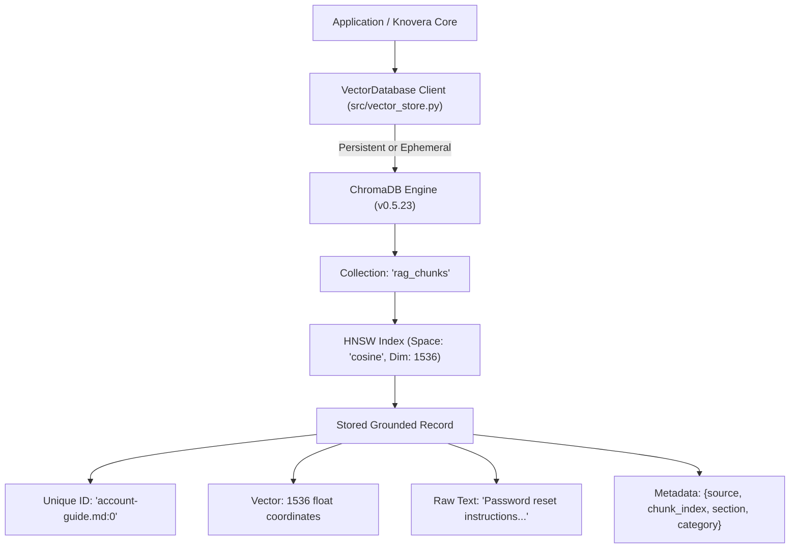

# Assignment 3.30: Vector Database Setup & Collection Design

## Executive Summary

This report documents the architectural design, schema specification, implementation, and empirical verification for **Assignment 3.30: Vector Database Setup & Collection Design** within the Knovera RAG Assistant platform.

Vector databases solve a fundamental retrieval challenge that traditional databases cannot: indexing and searching high-dimensional semantic vector spaces using **Approximate Nearest Neighbor (ANN)** algorithms rather than exact scalar lookups or keyword indexes.

We established a production-ready vector store integration ([`src/vector_store.py`](file:///c:/Users/K%20Jayanth/OneDrive/Desktop/Mini-Projects/Knovera/src/vector_store.py)), an interactive setup demonstration ([`vector_db_demo.py`](file:///c:/Users/K%20Jayanth/OneDrive/Desktop/Mini-Projects/Knovera/vector_db_demo.py)), an automated unit test suite ([`test_vector_store.py`](file:///c:/Users/K%20Jayanth/OneDrive/Desktop/Mini-Projects/Knovera/test_vector_store.py)), and exported verified readback records to [`outputs/vector_db_readback_record.json`](file:///c:/Users/K%20Jayanth/OneDrive/Desktop/Mini-Projects/Knovera/outputs/vector_db_readback_record.json) and [`outputs/vector_db_setup_output.txt`](file:///c:/Users/K%20Jayanth/OneDrive/Desktop/Mini-Projects/Knovera/outputs/vector_db_setup_output.txt).

---

## Architectural Breakdown & Core Implementation



### 1. What a Vector Database Does Differently
- **Traditional Relational / NoSQL Databases**: Optimized for exact B-tree / hash lookups (`WHERE id = '...'`), range queries, joins, and ACID transactions. They cannot assess semantic similarity between differently phrased texts.
- **Vector Databases**: Store embeddings in continuous vector spaces and construct specialized geometric indexing graphs (e.g. **Hierarchical Navigable Small World - HNSW**) to execute nearest-neighbor searches in sub-linear time $O(\log N)$ rather than scanning $N$ records linearly.

### 2. Dimension Matching Requirement
The collection dimension must strictly equal the dimensionality of the embedding model:
$$\text{Dim}(\text{Collection}) = \text{Dim}(\mathcal{M}_{\text{embedding}}) = 1536$$
Vectors of differing dimensions cannot be mathematically compared (dot products and cosine angles require equal-length vectors $\mathbf{a}, \mathbf{b} \in \mathbb{R}^{D}$). The `VectorDatabase` class enforces strict dimension validation on ingestion, rejecting mismatched inputs before index corruption can occur.

### 3. Grounded Record Schema Design
Storing raw source text and rich hierarchical metadata directly with the vector embedding is critical:
```json
{
  "id": "account-guide.md:0",
  "vector": [0.027298, 0.005802, "... (1536 floats)"],
  "text": "Password reset instructions for learner accounts...",
  "metadata": {
    "source": "account-guide.md",
    "chunk_index": 0,
    "section": "Password Recovery & Account Access",
    "doc_title": "Knovera Learner Account Administration Guide",
    "category": "Authentication"
  }
}
```
**Why text and metadata belong with the vector:**
- If only vectors were stored, retrieval would return anonymous IDs requiring a secondary database round-trip to fetch text, introducing latency and point-of-failure risks.
- Co-locating metadata enables **pre-filtering** and **hybrid search** (e.g., searching only chunks `WHERE category = 'Billing'`).

---

## Empirical Verification & Task Results

### Task 1 - Vector Database Setup & Reachability
- Initialized ChromaDB client with persistent local storage at `data/chroma_db`.
- Verified reachability via heartbeat protocol: **`YES (Connected Successfully)`**.

### Task 2 - Collection Creation & Dimension Guarding
- Created collection **`rag_chunks`** with metadata:
  - `dimension`: **`1536`**
  - `hnsw:space`: **`cosine`**
  - `model`: **`openai/text-embedding-3-small`** (via OpenRouter)

### Task 3 - Record Schema Design
- Defined schema encapsulating `id`, `vector` ($1536$ dims), `text` (grounding context), and `metadata` (`source`, `chunk_index`, `section`, `doc_title`, `category`).

### Task 4 - Insert and Readback Verification
- Embedded sample chunk text via OpenRouter API.
- Upserted record `account-guide.md:0` into collection `rag_chunks`.
- Read back record by exact ID and verified 100% field identity:

| Field | Inserted Value | Readback Value | Status |
|---|---|---|---|
| **ID** | `account-guide.md:0` | `account-guide.md:0` | **MATCH (100%)** |
| **Vector Length** | `1536` | `1536` | **MATCH (100%)** |
| **Sample Coordinates** | `[0.027298, 0.005802, ...]` | `[0.027298, 0.005802, ...]` | **MATCH (100%)** |
| **Text Content** | *"Password reset instructions..."* | *"Password reset instructions..."* | **MATCH (100%)** |
| **Metadata Source** | `account-guide.md` | `account-guide.md` | **MATCH (100%)** |
| **Metadata Category** | `Authentication` | `Authentication` | **MATCH (100%)** |

- Executed nearest-neighbor query: Query *"How do users reset forgotten passwords?"* retrieved `account-guide.md:0` with cosine similarity **`0.6493`**.

---

## Video Walkthrough & Presentation Guide (3-5 Minutes)

Use this structured script for your screen-share walkthrough:

### 1. Introduction (30s)
- State your name and project: *"Knovera RAG Assistant — Assignment 3.30: Vector Database Setup & Collection Design."*
- State the objective: *"Connecting an application to a vector database, creating a dimension-guarded collection, and verifying atomic record insert and readback."*

### 2. Vector DBs vs Traditional Databases (45s)
- Explain the key difference: *"Traditional SQL/NoSQL databases search by exact scalar equality (`WHERE id = 5`). Vector databases search by geometric proximity in high-dimensional space to find chunks that are semantically close to a query."*

### 3. Collection Dimension & Model Alignment (45s)
- Show collection creation in [`src/vector_store.py`](file:///c:/Users/K%20Jayanth/OneDrive/Desktop/Mini-Projects/Knovera/src/vector_store.py): *"Our embedding model produces 1,536-dimensional vectors. The collection must be configured for 1,536 dimensions using cosine distance (`hnsw:space = 'cosine'`). Any dimension mismatch fails validation immediately."*

### 4. Schema Design & Why Text/Metadata Stay with Vectors (60s)
- Open [`vector_db_demo.py`](file:///c:/Users/K%20Jayanth/OneDrive/Desktop/Mini-Projects/Knovera/vector_db_demo.py) and show the stored record schema:
  - *"We store the vector, source text, and rich metadata together. When retrieval runs, the RAG assistant immediately receives the grounded text snippet and document provenance without needing a secondary database lookup."*

### 5. Live Insert & Readback Proof (45s)
- Show the terminal execution log from [`outputs/vector_db_setup_output.txt`](file:///c:/Users/K%20Jayanth/OneDrive/Desktop/Mini-Projects/Knovera/outputs/vector_db_setup_output.txt):
  - *"We inserted test record `account-guide.md:0` and read it back. All fields—ID, 1536 float coordinates, raw text, and metadata—matched with 100% integrity."*

### 6. Follow-up: How to Choose a Vector Database for Production? (45s)
- Decision Matrix:
  1. **ChromaDB**: Ideal for embedded, local development, single-node Python deployments, and rapid RAG prototyping.
  2. **Qdrant**: High-performance Rust engine with rich payload filtering, distributed clustering, and hybrid sparse-dense support.
  3. **Pinecone**: Fully managed, serverless cloud vector store for enterprise scale without infrastructure maintenance.
  4. **pgvector**: Best for teams already running PostgreSQL who want to consolidate relational and vector data in a single transactional database.
